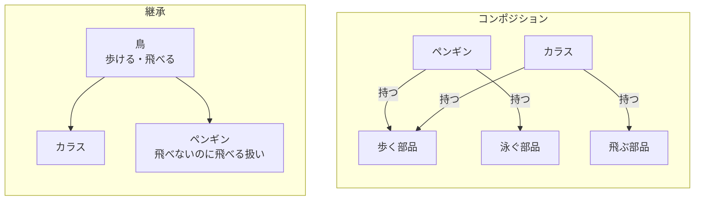

# はじめに
弊社のつよつよエンジニアに「最近は継承よりコンポジションやで」とご指摘頂いたのですが、よくわかってなかったので勉強したものをまとめます。
Go使ってる人はすんなり入ってくるというか、普段から意識しているような内容かと思います。

「継承よりコンポジション（Composition over Inheritance）」自体は最近の言葉ではなく、GoFのデザインパターン本（1994年）の時点で「クラス継承よりもオブジェクトコンポジションを多用すること」として挙げられていた原則みたいですね。

https://www.sbcr.jp/product/4797311126/

本記事ではC#とGoで同じ題材を書き比べます。DIコンテナやフレームワークの話はここでは取り扱いません。

# 環境

- Mac M3
- .NET 10
- Go 1.26.4

# そもそも何が違うのか

| | 継承 | コンポジション |
|---|---|---|
| 関係性 | is-a（〜は〜である） | has-a（〜は〜を持つ） |
| 機能の増やし方 | 親クラスから受け継ぐ | 部品を組み合わせる |
| 親の変更の影響 | 子クラス全部に波及する | 部品を使う側だけで吸収できる |
| 機能の取捨選択 | できない（全部ついてくる） | できる（必要な部品だけ持つ） |

ざっくりまとめると「機能をもらう」か「機能を持つ」かの違いという感じですね。

図にするとこうです。継承は縦に積むイメージ、コンポジションは横に並べた部品を選んで持つイメージです。



継承側のペンギンにはすでに不穏な気配がありますが、これを実際にコードで確かめていきます。

# 継承で書いてみる（C#）

鳥を題材にします。「鳥は歩けて飛べる」という基底クラスを作って、カラスとペンギンに継承させてみます。

```c#:継承の場合
// 鳥の基底クラス
public class Bird
{
    public string Name { get; }
    public Bird(string name) => Name = name;

    public void Walk() => Console.WriteLine($"{Name}は歩ける");
    public virtual void Fly() => Console.WriteLine($"{Name}は飛べる");
}

public class Crow : Bird
{
    public Crow() : base("カラス") { }
}

// ペンギンは鳥だけど飛べない…継承したFly()が邪魔になる
public class Penguin : Bird
{
    public Penguin() : base("ペンギン") { }

    // 苦肉の策で潰す
    public override void Fly() => throw new NotSupportedException("ペンギンは飛べません");
}
```

カラスは何の問題もありません。問題はペンギンです。

ペンギンは鳥なので`Bird`を継承したくなりますが、飛べません。
継承すると`Fly()`が問答無用でついてくるので、例外を投げて潰すという苦しい実装になっています。

実行してみます。

```c#:Program.cs
var penguin = new Penguin();
penguin.Walk();
penguin.Fly(); // コンパイルは通ってしまう
```

```text:実行結果
ペンギンは歩ける
Unhandled exception. System.NotSupportedException: ペンギンは飛べません
```

コンパイルは普通に通って、実行して初めて例外で死にます。
「`Bird`型なら`Fly()`できるはず」という呼び出し側の期待を子クラスが裏切っている状態で、いわゆるリスコフの置換原則（LSP）違反というやつですね。

LSPは「子クラスは親クラスの代わりとして使えなければならない」という原則で、SOLID原則のLにあたります。継承クラスで新しい型の例外を投げてはいけない、というのもまさに今回のペンギンのことですね。詳しくはMicrosoftの解説がわかりやすいです。

https://learn.microsoft.com/ja-jp/archive/msdn-magazine/2014/may/csharp-best-practices-dangers-of-violating-solid-principles-in-csharp

## 継承の問題点

今回のペンギン以外にも、継承には以下のような問題があると言われています。

| 問題 | 内容 |
|---|---|
| 脆い基底クラス問題 | 親クラスを変更すると子クラス全部が壊れる可能性がある |
| 不要な機能の押し付け | 親の機能が全部ついてくる（今回のペンギン） |
| 階層の深化 | 継承ツリーが深くなると誰が何を持っているのか追えなくなる |
| 単一継承の制約 | C#は多重継承できないので「歩く鳥」と「泳ぐ魚」の両方からは継承できない |

## 脆い基底クラス問題を体感する

表の1行目の「脆い基底クラス問題」は名前だけだとピンとこないので、実際に壊してみます。

「追加された回数を数えられるリスト」を継承で作るとします。

```c#:親クラス
public abstract class ItemList
{
    protected readonly List<string> Items = new();

    public virtual void Add(string item) => Items.Add(item);

    public virtual void AddRange(IEnumerable<string> items)
    {
        // 直接リストに追加している
        foreach (var i in items) Items.Add(i);
    }

    public int Count => Items.Count;
}
```

```c#:子クラス
// 追加された回数を数えたい
public class CountingList : ItemList
{
    public int AddCount { get; private set; }

    public override void Add(string item)
    {
        AddCount++;
        base.Add(item);
    }

    public override void AddRange(IEnumerable<string> items)
    {
        AddCount += items.Count();
        base.AddRange(items);
    }
}
```

```c#:Program.cs
var list = new CountingList();
list.Add("a");
list.AddRange(new[] { "b", "c" });
Console.WriteLine($"要素数: {list.Count} / 追加回数: {list.AddCount}");
```

```text:実行結果
要素数: 3 / 追加回数: 3
```

正しく動いています。

ここで親クラスの担当者が「`AddRange`の中身、`Add`を再利用したほうがきれいじゃない？」と思ってリファクタリングしたとします。

```c#:親クラスの修正
    public virtual void AddRange(IEnumerable<string> items)
    {
        // Add()を再利用するようにリファクタリング（一見無害）
        foreach (var i in items) Add(i);
    }
```

親クラス単体で見ると、公開されている振る舞いは何も変わっていません。ただの内部リファクタリングです。
ですが同じコードをもう一度実行すると…

```text:実行結果
要素数: 3 / 追加回数: 5
```

壊れました。

親の`AddRange`が呼ぶ`Add`は、オーバーライドされた**子の**`Add`です。子は`AddRange`で先にカウントを足しているので、二重カウントになります。

- 親は何も悪いことをしていない（振る舞いを変えていない）
- 子も何も変えていない
- なのに壊れる

継承していると、親の「公開されたインターフェース」だけでなく「内部でどのメソッドがどのメソッドを呼んでいるか」にまで依存してしまう、というのが脆い基底クラス問題です。

ちなみに今回の親クラスは`abstract`にしていますが、見ての通り防げていません。`abstract`が禁止するのは親自体の`new`だけで、実装を持った`virtual`メソッドを継承させている時点でこの問題はついてきます。「とりあえず基底はabstractにしておけば安全」とはならないわけですね。防げるのは実装を持たない`interface`だけです。

これをコンポジション+interfaceで書くとこうなります。

```c#:コンポジション版
// 型の抽象はinterfaceで提供する（実装を持たないので脆さもない）
public interface IItemList
{
    void Add(string item);
    void AddRange(IEnumerable<string> items);
    int Count { get; }
}

// 実装の再利用はコンポジションで（List<string>を継承せず「持つ」）
public class CountingList : IItemList
{
    private readonly List<string> _items = new();
    public int AddCount { get; private set; }

    public void Add(string item)
    {
        AddCount++;
        _items.Add(item);
    }

    public void AddRange(IEnumerable<string> items)
    {
        AddCount += items.Count();
        _items.AddRange(items); // List側の内部実装が変わっても影響なし
    }

    public int Count => _items.Count;
}
```

```c#:Program.cs
// IItemListを受け取る側は実装を知らなくていい
static void Register(IItemList list)
{
    list.Add("a");
    list.AddRange(new[] { "b", "c" });
}

var list = new CountingList();
Register(list); // 置換可能性はinterfaceが担保
Console.WriteLine($"要素数: {list.Count} / 追加回数: {list.AddCount}");
```

```text:実行結果
要素数: 3 / 追加回数: 3
```

`List<string>`の中で何がどう呼ばれていようが、境界が「公開メソッドを呼ぶ」だけになっているので巻き込まれません。

ここで整理しておきたいのが、継承版の`CountingList : ItemList`は実は2つのものを同時に受け取っていたという点です。

| 継承が提供していたもの | コンポジション+interfaceでの置き換え |
|---|---|
| 実装の再利用（`Items.Add`などの中身） | `List<string>`を持って委譲する |
| 型としての置換可能性（`ItemList`として渡せる） | `IItemList`を実装する |

継承はこの2つが抱き合わせで、実装の再利用が欲しいだけでも置換可能性（と親の内部実装への依存）がついてきます。
コンポジション+interfaceに分解すると、実装の再利用はコンポジションが、置換可能性は実装を持たないinterfaceが担当するので、脆い基底クラス問題の入り込む余地がなくなるわけですね。

# コンポジションで書き直す（C#）

「鳥である」ことをやめて、「歩ける」「飛べる」「泳げる」という機能の部品に分解します。

```c#:コンポジションの場合
public interface IWalkable
{
    void Walk();
}

public interface IFlyable
{
    void Fly();
}

public interface ISwimmable
{
    void Swim();
}

// 小さな機能パーツ
public class WalkAbility : IWalkable
{
    private readonly string _name;
    public WalkAbility(string name) => _name = name;
    public void Walk() => Console.WriteLine($"{_name}は歩ける");
}

public class FlyAbility : IFlyable
{
    private readonly string _name;
    public FlyAbility(string name) => _name = name;
    public void Fly() => Console.WriteLine($"{_name}は飛べる");
}

public class SwimAbility : ISwimmable
{
    private readonly string _name;
    public SwimAbility(string name) => _name = name;
    public void Swim() => Console.WriteLine($"{_name}は泳げる");
}
```

この部品を、各クラスが必要な分だけ持ちます。

```c#:部品を組み合わせる
// カラスは「歩く」「飛ぶ」を持つ
public class Crow : IWalkable, IFlyable
{
    private readonly IWalkable _walker;
    private readonly IFlyable _flyer;

    public Crow()
    {
        _walker = new WalkAbility("カラス");
        _flyer = new FlyAbility("カラス");
    }

    public void Walk() => _walker.Walk();
    public void Fly() => _flyer.Fly();
}

// ペンギンは「歩く」「泳ぐ」だけ持つ。Fly()はそもそも存在しない
public class Penguin : IWalkable, ISwimmable
{
    private readonly IWalkable _walker;
    private readonly ISwimmable _swimmer;

    public Penguin()
    {
        _walker = new WalkAbility("ペンギン");
        _swimmer = new SwimAbility("ペンギン");
    }

    public void Walk() => _walker.Walk();
    public void Swim() => _swimmer.Swim();
}
```

```c#:Program.cs
var penguin = new Penguin();
penguin.Walk();
penguin.Swim();
penguin.Fly(); // これはコンパイルエラーになる
```

```text:ビルド結果
error CS1061: 'Penguin' does not contain a definition for 'Fly'
```

継承版では実行時例外だった「ペンギンが飛ぶ」が、コンポジション版ではそもそもコンパイルが通りません。
実行しないと気づけないバグが、コンパイル時点で潰せるようになったのがわかるでしょうか。

`Fly()`を潰すのではなく、最初から持たせない。この方向の解決ができるのがコンポジションの強みかなと思います。

# Goで書いてみる

Goにはそもそもクラス継承がありません。言語仕様レベルで「継承よりコンポジション」に振り切っている言語です。

代わりにembedding（埋め込み）という仕組みがあります。

```go:embedding
type Animal struct {
	Name string
}

func (a Animal) Breathe() {
	fmt.Printf("%sは息をする\n", a.Name)
}

// DogはAnimalを埋め込む
type Dog struct {
	Animal
}

func (d Dog) Bark() {
	fmt.Printf("%s:ワン！\n", d.Name)
}
```

```go:main.go
d := Dog{Animal: Animal{Name: "ポチ"}}
d.Breathe() // Animalのメソッドがそのまま呼べる
d.Bark()
```

```text:実行結果
ポチは息をする
ポチ:ワン！
```

一見継承に見えますが、これは「`Dog`が`Animal`をフィールドとして持っていて、呼び出しが自動で委譲されているだけ」です。
`Dog`は`Animal`型として振る舞えるわけではない（`Animal`を引数に取る関数に`Dog`は渡せない）ので、is-aではなくhas-a、つまりembeddingはコンポジションの糖衣構文という感じですね。

## Goでペンギン問題を書く

C#と同じ題材をGoで書くとこうなります。

```go:コンポジションの場合
type WalkAbility struct{ Name string }
type SwimAbility struct{ Name string }
type FlyAbility struct{ Name string }

func (w WalkAbility) Walk() { fmt.Printf("%sは歩ける\n", w.Name) }
func (s SwimAbility) Swim() { fmt.Printf("%sは泳げる\n", s.Name) }
func (f FlyAbility) Fly()   { fmt.Printf("%sは飛べる\n", f.Name) }

// Duckは歩き・泳ぎ・飛びを「持つ」
type Duck struct {
	walker  WalkAbility
	swimmer SwimAbility
	flyer   FlyAbility
}

func NewDuck(name string) Duck {
	return Duck{
		walker:  WalkAbility{Name: name},
		swimmer: SwimAbility{Name: name},
		flyer:   FlyAbility{Name: name},
	}
}

func (d Duck) Walk() { d.walker.Walk() }
func (d Duck) Swim() { d.swimmer.Swim() }
func (d Duck) Fly()  { d.flyer.Fly() }

// Penguinは歩きと泳ぎだけ持つ
type Penguin struct {
	walker  WalkAbility
	swimmer SwimAbility
}

func NewPenguin(name string) Penguin {
	return Penguin{
		walker:  WalkAbility{Name: name},
		swimmer: SwimAbility{Name: name},
	}
}

func (p Penguin) Walk() { p.walker.Walk() }
func (p Penguin) Swim() { p.swimmer.Swim() }
```

```go:main.go
penguin := NewPenguin("ペンギン")
penguin.Walk()
penguin.Swim()
penguin.Fly() // コンパイルエラー
```

```text:ビルド結果
./main.go:89:10: penguin.Fly undefined (type Penguin has no field or method Fly)
```

C#と同じく、「飛べないのに飛ばされる」がコンパイル時点で弾かれました。

## Goはインターフェースが暗黙的

Goの場合はさらに、インターフェースが暗黙的に満たされる（implementsの宣言が不要）ので、後付けの抽象化がやりやすいです。

```go:後からインターフェースを定義する
// 「飛べるもの」というインターフェースを後から定義
type Flyer interface {
	Fly()
}

func Airshow(f Flyer) {
	fmt.Println("=== エアショー開始 ===")
	f.Fly()
}
```

```go:main.go
duck := NewDuck("アヒル")

// DuckはFlyerをimplements宣言していないが、Fly()を持つので渡せる
Airshow(duck)
```

```text:実行結果
=== エアショー開始 ===
アヒルは飛べる
```

`Duck`側は`Flyer`の存在すら知らないのに、`Fly()`を持っているというだけで`Flyer`として扱えます。
C#だと使う側の都合でインターフェースを増やすには実装クラス側に`: IFlyable`を追記する必要がありますが、Goは実装側を一切触らずに抽象を切り出せるわけです。

普段Goを書いている人は、意識せずコンポジションで設計させられていたわけですね。

# じゃあ継承は使っちゃダメなのか

そういうわけでもないと思います。

- 本当にis-aの関係が成立していて
- 親クラスの実装を子が把握できる範囲にあり
- 階層が浅い

場合は、継承の方が素直に書けることもあります。C#の標準ライブラリやフレームワーク（`Controller`を継承するASP.NETなど）も継承を普通に使っています。

## コンポジションのデメリット

コンポジションも無料ではなくて、今回のコードでもすでに出ていますが

```c#
    public void Walk() => _walker.Walk();
    public void Fly() => _flyer.Fly();
```

のような**委譲するだけのコード**が機能の数だけ増えます。継承なら1行も書かずに済んでいた部分です。
クラスや部品の数も増えるので、小規模なコードだとむしろ見通しが悪くなることもあります。

なので使い分けとしては

| やりたいこと | 選ぶもの |
|---|---|
| コードを再利用したい | コンポジション |
| 型として置換可能にしたい（本当のis-a） | 継承（+ LSPを守る） |

という感じで、問題なのは「コードを再利用したいだけなのに継承を使う」ケース。再利用が目的ならコンポジションを選ぶ、というのが今回の原則の趣旨のようです。

# まとめ

- 継承は機能が問答無用で全部ついてくるので、「持ってるけど使えない機能」が生まれると実行時例外で対処するハメになる
- 継承すると親の内部実装（どのメソッドがどのメソッドを呼ぶか）にまで依存するので、親の無害なリファクタリングで子が壊れる（脆い基底クラス問題）
- コンポジションは必要な機能だけ持たせられるので、間違った呼び出しをコンパイル時点で弾けるし、変更の影響も部品の境界で止まる
- 継承が絶対悪なわけではなく、「再利用のための継承」をやめようという話

ペンギンを実際に飛ばそうとしてみて、ようやく理解。
