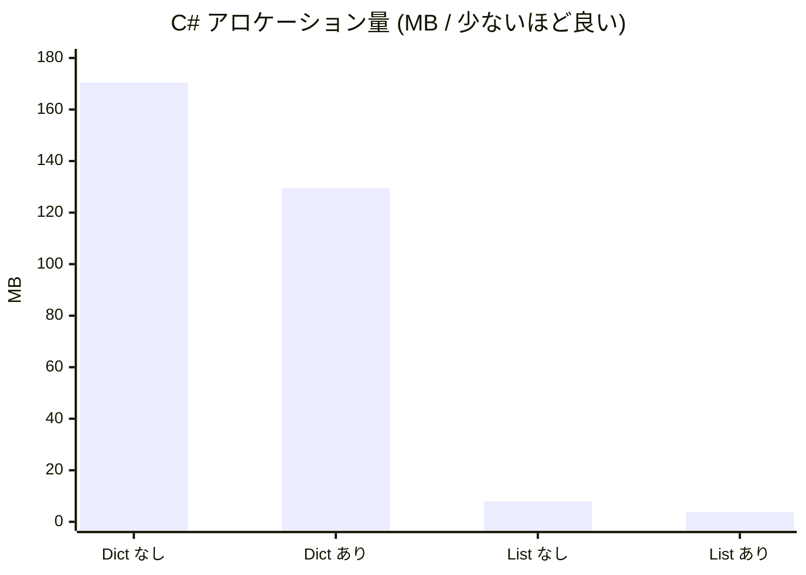
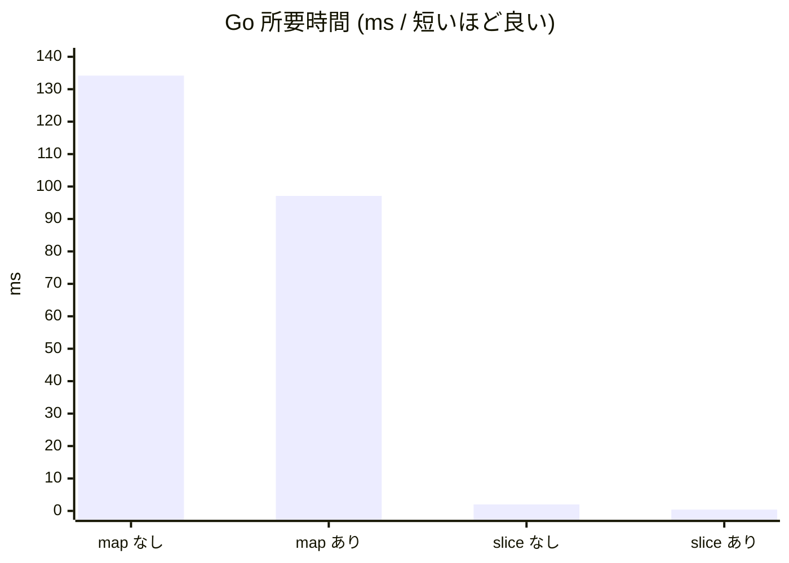
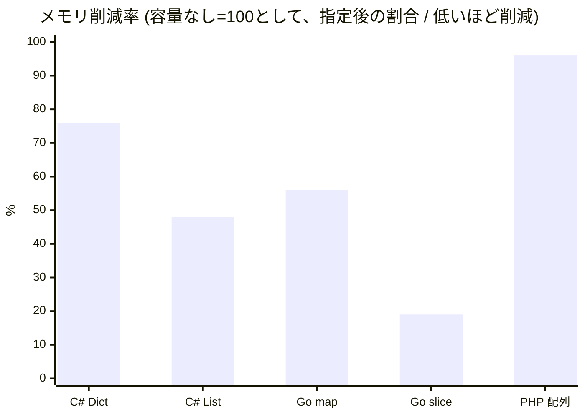

# はじめに

X でこんなポストが流れてきました。

https://x.com/theskilledcoder/status/2053002328643686605

> **What's wrong with this code from a performance perspective?**（パフォーマンス観点でこのコードの何が問題？）

```java
import java.util.*;

public class Test {
    public static void main(String[] args) {
        // We know we'll store 10,000 entries
        Map<String, Object> map = new HashMap<>();

        for (int i = 0; i < 10000; i++) {
            map.put("key" + i, new Object());
        }
    }
}
```

答えは**1万件入れると分かっているのに、初期容量を指定せず `new HashMap<>()` で作っている**ことですね。

Grokにより詳しく聞いてみたら
> ・ 初期容量16・負荷率0.75のため、サイズ拡大時に10回以上のリサイズが発生し、各回で全エントリの再ハッシュ処理が必要になる

なるほど。`HashMap`は可変長なので都度都度サイズ拡大されるからリサイズのコストが重くなる。ってことですよね。

ざっくり知ってはいたんですが、正直なところ

**「実務でそこまで気にするほどか？」**

とずっと思ってます。普段の開発では基本的に可変長配列（`List` や slice、PHP の配列）しか使わないし、容量なんて指定したことがほとんどありません。

Goはどのチュートリアルでも容量指定が当たり前のように指示されているので書くこともありますが、正直意識はしていません。

そこで、**知っているフリで終わらせず、実際にコードを書いて測ってみよう**というのがこの記事です。C# / Go / PHP の3言語で、ハッシュマップと可変長配列それぞれについて「容量指定あり/なし」を計測しました。

# TL;DR

100万件を投入したときの「容量指定なし → あり」での改善幅です（数値は後述、マシン依存なので比率で見てください）。

| 言語 | 対象 | 時間の改善 | メモリの改善 |
|------|------|:--:|:--:|
| **Go** | slice | **約5倍速** | **約5分の1** |
| **Go** | map | 約1.4倍速 | 約0.6倍 |
| **C#** | List | 環境差大（ブレやすい） | **約2分の1** |
| **C#** | Dictionary | 環境差大（ブレやすい） | 約0.76倍 |
| **PHP** | 配列 | ほぼ変わらず（むしろ微減速） | ほぼ変わらず |

先に結論を言うと、**「気にするべきか」は言語と状況による**でした。Go の slice のように劇的に効くものもあれば、PHP の配列のようにほぼ意味がない（そもそも指定する手段がない）ものもあります。

# 環境

| 項目 | バージョン |
|------|-----------|
| マシン | Mac M3 |
| C# | .NET 10.0.8 |
| Go | go1.26.4 |
| PHP | 8.5.6 |

計測に使ったコードはすべてこのリポジトリに置いてあります。

https://github.com/Pokeyama/shimoyama-qiita-articles/commit/b44972e8c5f054760ed21371cb6fc8f611efee1b

# 計測方法

各言語で次の条件をそろえました。

- 要素数 `N = 1,000,000`（ポストの1万件では一瞬で終わって差が見えないため増量）
- ウォームアップ後、**7回実行して平均**
- **ハッシュマップ系**（ポスト元ネタの `HashMap` 相当）と、**可変長配列系**（普段使うやつ）の両方を計測
- 計測指標は**所要時間**と**メモリ**

メモリ指標は言語ごとに測り方が違う点に注意してください。

| 言語 | メモリ指標 | 意味 |
|------|-----------|------|
| C# | `GC.GetAllocatedBytesForCurrentThread()` の差分 | 累計アロケーション量 |
| Go | `runtime.MemStats.TotalAlloc` の差分 | 同上 |
| PHP | `memory_get_peak_usage(true)` | OS から確保した実メモリのピーク |

C#での計測方法が難しかったのでRedditのこちらのスレを参考にしました。Riderで見れた気がするので持ってる方はそちらの方がいいと思います。

https://www.reddit.com/r/csharp/comments/1mnu9e7/how_would_you_measure_the_memory_allocations_of/?tl=ja

Goはさすがでわかりやすかったです。

https://imagawa.hatenadiary.jp/entry/2016/12/22/190000

https://qiita.com/naofunky/items/8e24812ff5a446c7a78e

# なぜリサイズが遅いのか

そもそもなぜ容量指定で速くなるのか、仕組みを軽くおさらいします。

可変長のコレクション（動的配列やハッシュテーブル）は、内部的に固定長の配列を持っていて、要素が入りきらなくなると**より大きい配列を新しく確保して、既存要素を全部コピーする**ことで拡張します。増え方は実装により異なりますが、多くの場合は倍々（2倍前後、実装によっては1.5倍）に拡張されます。

100万件を初期容量なしで入れると、この拡張が（例えば2倍ずつ伸びる実装なら）`16 → 32 → 64 → ...` と十数回発生します。具体的な拡張係数や初期値は言語・実装によって異なりますが、いずれにせよ1回1回のコピーは O(n) で、捨てられた古い配列はゴミ（GC対象）になります。

最初から `N` 件分を確保しておけば、この**途中の再確保とコピーがまるごと消える**、というのが容量指定の効果です。

では、実際にどれだけ効くのか見ていきます。

# 計測結果

## C# (.NET 10)

```csharp:capacity-benchmark/csharp/Program.cs
// ポストと同じく string キー + object 値を1,000,000件
static object BuildDictNoCap()
{
    var map = new Dictionary<string, object>();        // 容量指定なし
    for (int i = 0; i < N; i++) map.Add("key" + i, new object());
    return map;
}

static object BuildDictCap()
{
    var map = new Dictionary<string, object>(N);       // 件数が分かっているので最初から確保
    for (int i = 0; i < N; i++) map.Add("key" + i, new object());
    return map;
}
```

結果は次のとおりです。

| 対象 | 容量指定 | 時間 (ms) | アロケーション (MB) |
|------|:--:|--:|--:|
| `Dictionary<string,object>` | なし | 38.5 | 170.4 |
| `Dictionary<string,object>` | あり | **29.8** | **129.5** |
| `List<int>` | なし | 0.8 | 8.0 |
| `List<int>` | あり | **0.6** | **3.8** |



メモリ（アロケーション量）は `Dictionary` で約24%、`List<int>` では半分以下まで削減できました。

100回ほど行ってみて全ての結果で指定ありのほうが結果は良かったのですが、数値にバラツキが結構あったので、GCのタイミングとかで変わりそうです。
計測の仕方が悪いのかもしれない。

## Go (1.26)

```go:capacity-benchmark/go/main.go
func buildSliceNoCap() any {
	var s []int                  // 容量指定なし（nil スライス）
	for i := 0; i < N; i++ {
		s = append(s, i)
	}
	return s
}

func buildSliceCap() any {
	s := make([]int, 0, N)       // 長さ0・容量N で確保しておく
	for i := 0; i < N; i++ {
		s = append(s, i)
	}
	return s
}
```

| 対象 | 容量指定 | 時間 (ms) | アロケーション (MB) |
|------|:--:|--:|--:|
| `map[string]struct{}` | なし | 134.2 | 121.7 |
| `map[string]struct{}` | あり | **97.1** | **68.6** |
| `[]int` | なし | 2.0 | 39.7 |
| `[]int` | あり | **0.4** | **7.6** |



**今回いちばん差が出たのがGoのslice** でした。`make([]int, 0, N)` で容量を先に確保すると、**時間は約5倍速、メモリは約5分の1**。`append` による再確保がまるごと消えるためで、ホットパスなら無視できない差です。

`map` も時間1.4倍速・メモリ0.6倍とはっきり効きました。Go の `map` は容量ヒントを `make(map[K]V, hint)` で渡せるので、件数が読めるなら必ず書くべきです。

## PHP (8.5)

PHP の通常の配列（内部はハッシュテーブル）には、**初期容量を指定する手段がありません**。なので「自動リサイズされる通常配列」と、固定長で先に確保できる **`SplFixedArray`** を比較しました。

```php:capacity-benchmark/php/benchmark.php
function buildArrayNoCap(): array
{
    $a = [];
    for ($i = 0; $i < N; $i++) {
        $a[] = $i;                 // 末尾追加。内部ハッシュテーブルが自動リサイズされる
    }
    return $a;
}

function buildSplFixed(): SplFixedArray
{
    $a = new SplFixedArray(N);     // 件数が分かっているので固定長で確保
    for ($i = 0; $i < N; $i++) {
        $a[$i] = $i;
    }
    return $a;
}
```

`SplFixedArray` は「通常配列に容量指定したもの」ではなく**別のデータ構造**（固定長配列）なので、あくまで代替比較として見てください。

| 対象 | 区分 | 時間 (ms) | ピークメモリ (MB) |
|------|:--:|--:|--:|
| 通常配列 `$a[] = i` | 自動リサイズ | **4.2** | 18.0 |
| `SplFixedArray(N)` | 代替（固定長確保） | 5.3 | **17.3** |
| 連想配列 `$a["key".i]` | 容量指定不可 | 30.0 | 97.7 |

そもそもが違うのでこうやって並べるのがどうなんだろうとは思いますが、

- **メモリはほぼ同じ**（18.0 → 17.3 MB）。PHPの配列はもともと省メモリで、リサイズも償却されているので、`SplFixedArray` にしてもほとんど得しません。
- **時間はむしろ `SplFixedArray` の方が遅い**。これは `SplFixedArray` がオブジェクトで、添字アクセスのたびに通常配列より一手間かかるためと思われます。

つまり PHP では、**素直に通常配列を使うのが時間・メモリの両面でバランスが良い**という結果でした。

# で、結局気にするべきなのか

3言語まとめると、容量指定の効きめはきれいに分かれました。



以下結論。

- **件数が事前に分かっていて、かつ大量（数万〜）で、かつホットパスなら指定する価値がある。** 特に **Goのslice** は必須。
- **C# の `List` / `Dictionary` も容量指定はノーコスト寄りの最適化**なので、件数が読めるなら書いておいて損はないはずです。
- **PHP の通常配列は気にしなくていい。** そもそも指定手段がなく、`SplFixedArray` に逃げてもメモリは変わらず時間は遅くなるので、基本は通常配列でOK。

# まとめ
コレクションってどの言語でも色々ありますが、ちゃんと使い分けが必要ですね。
消えずに残ってるということは意味があるということだと思うので。

## 参考

- [HashMap (Java SE Doc)](https://docs.oracle.com/javase/8/docs/api/java/util/HashMap.html)
- [Dictionary&lt;TKey,TValue&gt; Constructor (.NET)](https://learn.microsoft.com/dotnet/api/system.collections.generic.dictionary-2.-ctor)
- [Go: Slices intro and append](https://go.dev/blog/slices-intro)
- [PHP: SplFixedArray](https://www.php.net/manual/ja/class.splfixedarray.php)
