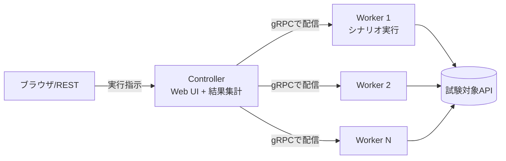

# はじめに

業務でMagicOnion(gRPC+MessagePack)なAPIサーバーの負荷試験をすることになりました。

負荷試験ツールというとk6やJMeterあたりが定番だと思うんですが、MagicOnionのAPIにはそのままでは使えません。
そこで、MagicOnionの開発者様が[DFrame](https://github.com/Cysharp/DFrame)という負荷試験ツールを用意してくださっています。

**シナリオをC#で書ける**のが特徴で、クライアントのコードがそのまま負荷シナリオになります。

MagicOnionはすでに幅広く使われていていて、負荷試験にはDFrameが真っ先に思いつく選択肢だと思うのですが、資料が少ないので記事にします。

# 対象読者

- DFrame導入してみた備忘録が少なくて困ってる人
- DFrameを触り始めたけど、Concurrency/Worker Limit/Repeatあたりがピンときていない人
- Ramp-Upなくて困ってる人

# 環境

- Mac M3
- .NET 10
- DFrame 2.0.0

# DFrameの構成

DFrameはControllerとWorkerの2つでできています。



- **Controller**: Web UIと結果集計の担当。ブラウザのこの画面から実行を指示する
- **Worker**: シナリオを実行する側。Controllerに常時gRPCでつながっていて、指示が来たら一斉に負荷をかける

「分散」フレームワークなのでWorkerを何台も並べられますが、1プロセスにControllerとWorkerを同居させることもできるので、ローカルで試すだけならバイナリ1個で完結します。

# 最小構成で動かす

NuGetで`DFrame`を入れて、Program.csにこれだけ書けば動きます。

```csharp:Program.cs
using DFrame;

DFrameApp.Run(7312, 7313); // WebUI:7312, Worker接続:7313

public class SampleWorkload : Workload
{
    public override async Task ExecuteAsync(WorkloadContext context)
    {
        Console.WriteLine($"Hello {context.WorkloadId}");
    }
}
```

DFrameではテストシナリオを`Workload`と呼びます。`Workload`を継承して`ExecuteAsync`を書くと、Web UIのセレクトボックスに自動で並んでくれます。

起動して http://localhost:7312 を開くとWeb UIが出ます。


# シナリオ(Workload)の書き方

`ExecuteAsync`のほかに`SetupAsync`/`TeardownAsync`があるので、接続の確立や後始末はそっちに書きます。gRPCだとこんな感じ。

```csharp:gRPCを叩くWorkload
public class GrpcTest : Workload
{
    GrpcChannel? channel;
    Greeter.GreeterClient? client;

    public override async Task SetupAsync(WorkloadContext context)
    {
        channel = GrpcChannel.ForAddress("http://localhost:5027");
        client = new Greeter.GreeterClient(channel);
    }

    public override async Task ExecuteAsync(WorkloadContext context)
    {
        await client!.SayHelloAsync(new HelloRequest(), cancellationToken: context.CancellationToken);
    }

    public override async Task TeardownAsync(WorkloadContext context)
    {
        if (channel != null)
        {
            await channel.ShutdownAsync();
            channel.Dispose();
        }
    }
}
```

MagicOnionなら`SetupAsync`で`MagicOnionClient.Create<IMyService>(channel)`する形になるだけで、構造は同じです。

大事なのが、**Setupは計測に含まれない**ところ。チャンネル確立のような準備をSetupに入れておけば、`ExecuteAsync`の計測値から準備時間を分離できます。

コンストラクタで引数も受け取れます。プリミティブな引数はWeb UIの入力欄になって、DIコンテナに登録した型はそのまま注入されます。

```csharp:引数とDI
var builder = DFrameApp.CreateBuilder(7312, 7313);
builder.ConfigureServices(services =>
{
    services.AddSingleton<HttpClient>();
});
await builder.RunAsync();

public class HttpGetString : Workload
{
    readonly HttpClient httpClient; // DIから注入
    readonly string url;            // Web UIの入力欄になる

    public HttpGetString(HttpClient httpClient, string url)
    {
        this.httpClient = httpClient;
        this.url = url;
    }

    public override async Task ExecuteAsync(WorkloadContext context)
    {
        await httpClient.GetStringAsync(url, context.CancellationToken);
    }
}
```

# パラメータの読み方

| パラメータ | 意味 |
|---|---|
| Concurrency | **Worker 1台の中に**作るWorkloadインスタンス数。この数だけ`ExecuteAsync`が並列で走る |
| Worker Limit | 使うWorkerの台数 |
| Total Request | `ExecuteAsync`の総実行回数。全Worker合計 |

基本的には**同時並列数=Worker台数×Concurrency**です。
各Workloadの実行回数は、おおむねTotal Request÷Worker台数÷Concurrencyで割り振られます。

大事なのが計測単位で、前述した通りDFrameの1リクエスト=`ExecuteAsync`で1回です。
シナリオの中で複数APIを呼ぶと「RPS」はAPI呼び出し数/秒ではなくシナリオ完了数/秒になります。
API単位のRPSが欲しいときは単一のWorkloadを作るか、シナリオ内で別途計測が必要となります。

# 実行モードは4つ

| モード | 動き |
|---|---|
| Request | Total Request回実行して終わり。基本のモード |
| Repeat | Requestが完了するたびに、Total RequestとWorker Limitを増やして繰り返す |
| Duration | 指定秒数だけ実行し続ける |
| Infinite | STOPを押すまで無限に実行 |

Durationで1つ注意なのが、時間切れ時の見え方です。
DFrame 2.0.0は`context.CancellationToken`による`OperationCanceledException`を捕捉して終了するため、通常は時間切れそのものをエラーに計上しません。
ただし、利用しているクライアントがキャンセルを`RpcException(StatusCode.Cancelled)`など別の例外として返すと、DFrame側ではエラーとして記録されます。
試験の終盤だけエラーが出ていたら、`errorMessage`を見てアプリの失敗と時間切れを切り分けるのがよさそうです。

# 段階的に負荷を上げるには

## Ramp-Upはどこ？

負荷試験ツールにはたいてい、目標の負荷まで仮想ユーザーを徐々に投入していくRamp-Up機能があります。k6なら`stages`、JMeterならThread GroupのRamp-Up Periodですね。DFrameで同じものを探しました。

**無い。**

READMEを読み直すと、Repeatモードの説明にこう書いてありました。

> Repeat is similar as Ramp-Up. After request completed, increase TotalRequest and WorkerLimit.

「RepeatはRamp-Upに似たもの」
つまり滑らかに増やす機能は無くて、段階的に増やすRepeatがその代わり、という位置付けみたいです。

[issue #40](https://github.com/Cysharp/DFrame/issues/40)でまさに「Locustのspawn rate相当はどう設定するのか」という質問があって、DFrameのコントリビューターがこう答えています。

> Unfortunately, there seems to be no default setting to gradually increase concurrency.
>
> It may be easier to run multiple executions in duration mode, changing the settings as you go.

「Concurrencyを徐々に増やすデフォルト設定は無い。設定を変えながらDurationモードで複数回まわすほうが楽だろう」とのこと。
回答の続きでは、WorkloadのIDを使ってシナリオ側で開始をずらす案にも触れています。
少なくとも2.0.0では、**滑らかなRamp-Upは標準機能として提供されていない**ものの、必要ならシナリオ側で組む余地はある、ということですね。

## そもそもRamp-Upって何のためにあるんだっけ

そもそもRamp-Upって何のためにあるんだっけ、と考えると、目的は大きく2つかなと思います。

- **開始スパイクの回避**
  試験開始の瞬間に全ユーザーが一斉に接続・認証・初回リクエストをやり出すと、測りたい定常負荷とは別物のスパイクがサーバーにかかります。これを避けるために投入を時間方向にばらす、というのがRamp-Up本来の使い方です。
- **温まっていないサーバーにいきなり満負荷を当てない**
  JITやキャッシュ、コネクションプール、オートスケールが温まってない状態に満負荷をぶつけると、定常性能とは別物の数字が出ます。低い負荷から順に上げて、温まったところで目標負荷を測るための助走ですね。

DFrameにはこの2つを滑らかにやる機能は無く、代わりに**Setup**と**Repeat**を使い分ける形になります。

| Ramp-Upの目的 | DFrameでの代わり |
|---|---|
| 開始スパイクの回避 | **Setup**に準備を逃がす |
| 温まってないサーバーに満負荷を当てない | **Repeat**で段階的に上げる |

ただし、どちらも本来のRamp-Upと同じ動きになるわけではありません。

- **Setup**: 接続・認証をSetupに書けば計測からは外れます(シナリオの書き方で前述)。ただしSetup自体も一斉に走り、直後の`ExecuteAsync`も同時集中するので、スパイクそのものは消えません。避けたいなら共有接続やSetup内で開始をずらす設計が別途必要です。
- **Repeat**: 低い負荷から順に上げて目標負荷まで持っていけます。ただし連続した線形ランプではなく「段が完了→次の段が一斉スタート」の繰り返しです。

Setupは前述どおり計測に含まれないので、ここからはもう一方のRepeatで実際に階段を組んでいきます。

## Repeatで階段負荷を組む

Repeatの増分パラメータは`Increase Total Request`と`Increase Worker`の2つで、**Concurrencyは増やせません**(全段で固定)。なので負荷を上げる軸は**Worker台数**になります。

Workerを増やすには`VirtualProcess`オプションを使います。

```csharp:Worker側の設定
var builder = DFrameApp.CreateBuilder(7312, 7313);
builder.ConfigureWorker(options =>
{
    options.VirtualProcess = 10; // 1プロセスを10台のWorkerに見せる
});
await builder.RunAsync();
```

これで1プロセスがControllerからは10台に見えます(Controllerへの接続ソケットが10本になるだけで、負荷をかける物理マシンは1台のまま)。
この状態で、たとえばこう設定します。

| 設定 | 値 |
|---|---|
| Concurrency | 10 |
| Total Request | 100 |
| Worker Limit | 1 |
| Increase Total Request | 100 |
| Increase Worker | 1 |
| Repeat | 10 |

すると各段はこうなります。

| 段 | Worker台数 | 同時並列数(台数×Concurrency) | Total Request |
|---|---|---|---|
| 1 | 1 | 10 | 100 |
| 2 | 2 | 20 | 200 |
| 3 | 3 | 30 | 300 |
| … | … | … | … |
| 10 | 10 | 100 | 1000 |

同時10から100まで、10刻みの階段負荷ですね。各段で1インスタンスあたりの実行回数(Total Request÷台数÷Concurrency=10回)が一定になるようIncrease Total Requestを合わせておくと、処理時間が大きく変わらない範囲では段ごとの試験時間も揃いやすくなります。負荷上昇によってレイテンシが伸びれば試験時間も伸びるので、厳密に同じ時間にはなりません。


実行すると、段ごとの結果が履歴に積まれていきます。


このように各段が独立した試験として完結して、段ごとに結果が別レコードで残ります。


一方、瞬間的なスパイク耐性やオートスケールの追従速度みたいに**負荷の傾斜そのものが試験対象**のケースは、DFrameの標準機能だけでは表現しにくいです。
issue #40の回答どおり、Concurrencyを変えたDurationを複数回実行するか、別のツールも含めて検討することになります。

# バグ？：REST APIのRepeatは増分が効かない

DFrameにはCLIから叩けるREST APIがあって、`POST /api/repeat`でRepeatモードを実行できます。
CIで実行したくて試したのですが、何段まわしても負荷が上がらない。。。

原因はたぶんDFrame本体(2.0.0時点)の[RestApi.cs](https://github.com/Cysharp/DFrame/blob/2.0.0/src/DFrame.Controller/RestApi.cs#L23-L30)かなと思います。

```csharp:DFrame.Controller/RestApi.cs(抜粋)
repeatModeState = new Pages.RepeatModeState(
    request.Workload, request.Concurrency, request.TotalRequest,
    request.IncreaseTotalWorker,  // ← 第4引数はincreaseTotalRequestが本来の引数？
    workerLimit,
    request.IncreaseTotalWorker,
    request.RepeatCount, ...);
```

# まとめ

Ramp-Upで駆け上がりの部分表現して負荷試験していた人たちにはちょっと考え方というか、やり方の転換が求められますね。
どちらにしてもMagicOnionとセットでこういったもの作っていただけて感謝。
