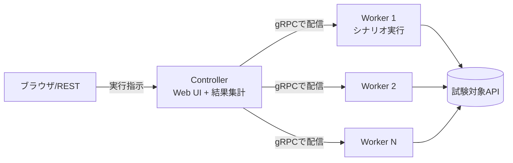

# はじめに

業務でMagicOnion(gRPC+MessagePack)なAPIサーバーに負荷試験をすることになりました。

負荷試験ツールというとk6やJMeterあたりが定番だと思うんですが、あれらはHTTP/JSON前提のツールなので、MessagePackで固めたgRPCを叩く手段がありません。MagicOnionのAPIには使えないわけです。(JSON変換用のエンドポイントを別に生やして叩く手もありますが、本番と違う経路で測った数字に意味はないので却下しました)

そこで見つけたのが[DFrame](https://github.com/Cysharp/DFrame)です。Cysharp製の分散負荷試験フレームワークで、**シナリオをC#で書ける**のが特徴。クライアントのコードがそのまま負荷シナリオになるので、gRPCだろうがMagicOnionだろうが関係なく叩けます。

で、使ってみたら概ね快適だったんですが、1つだけ「あれ？」となったことがありました。**負荷を徐々に上げていくRamp-Up機能が無い。** この記事は、DFrameのざっくりした使い方と、「Ramp-Upが無いのは仕様なの？」を調べた記録です。

# 対象読者

- gRPC/MagicOnionなAPIに負荷試験をしたいが、k6が使えなくて困っている人
- DFrameを触り始めたけど、Concurrency/Worker Limit/Repeatあたりがピンときていない人

# 環境

- Mac M3
- .NET 10
- DFrame 2.0.0

# DFrameの構成

DFrameはControllerとWorkerの2つでできています。



- **Controller**: Web UIと結果集計の担当。ブラウザのこの画面から実行を指示する
- **Worker**: シナリオを実行する側。Controllerに常時gRPCでつながっていて、指示が来たら一斉に負荷をかける

「分散」フレームワークなのでWorkerを何台も並べられますが、1プロセスにControllerとWorkerを同居させることもできるので、ローカルで試すだけならバイナリ1個で完結します。

# 最小構成で動かす

NuGetで`DFrame`を入れて、Program.csにこれだけ書けば動きます。

```csharp:Program.cs
using DFrame;

DFrameApp.Run(7312, 7313); // WebUI:7312, Worker接続:7313

public class SampleWorkload : Workload
{
    public override async Task ExecuteAsync(WorkloadContext context)
    {
        Console.WriteLine($"Hello {context.WorkloadId}");
    }
}
```

DFrameではテストシナリオを`Workload`と呼びます。`Workload`を継承して`ExecuteAsync`を書くと、Web UIのセレクトボックスに自動で並んでくれます。

1点だけ注意で、ControllerはASP.NET Coreで動くので、csprojのSdkを`Microsoft.NET.Sdk.Web`にして`RequiresAspNetWebAssets`を足す必要があります(.NET 10の場合)。

```xml:csproj
<Project Sdk="Microsoft.NET.Sdk.Web">
  <PropertyGroup>
    <TargetFramework>net10.0</TargetFramework>
    <RequiresAspNetWebAssets>true</RequiresAspNetWebAssets>
  </PropertyGroup>
</Project>
```

起動して http://localhost:7312 を開くとWeb UIが出ます。

<!-- TODO(スクショ1): Web UIのトップ画面。Workloadセレクトボックスに自作Workloadが並んでいて、Concurrency/Total Request/Worker Limitの入力欄が見える状態。EXECUTEボタン押下前でOK -->


# シナリオ(Workload)の書き方

`ExecuteAsync`のほかに`SetupAsync`/`TeardownAsync`があるので、接続の確立や後始末はそっちに書きます。gRPCだとこんな感じ。

```csharp:gRPCを叩くWorkload
public class GrpcTest : Workload
{
    GrpcChannel? channel;
    Greeter.GreeterClient? client;

    public override async Task SetupAsync(WorkloadContext context)
    {
        channel = GrpcChannel.ForAddress("http://localhost:5027");
        client = new Greeter.GreeterClient(channel);
    }

    public override async Task ExecuteAsync(WorkloadContext context)
    {
        await client!.SayHelloAsync(new HelloRequest(), cancellationToken: context.CancellationToken);
    }

    public override async Task TeardownAsync(WorkloadContext context)
    {
        if (channel != null)
        {
            await channel.ShutdownAsync();
            channel.Dispose();
        }
    }
}
```

MagicOnionなら`SetupAsync`で`MagicOnionClient.Create<IMyService>(channel)`する形になるだけで、構造は同じです。

地味に大事なのが、**Setupは計測に含まれない**ところ。チャンネル確立や認証・ユーザー登録みたいな準備をSetupに寄せておけば、`ExecuteAsync`の計測値が純粋に本番リクエストの数字になります。しかも全Workloadの準備が終わるのを待ってから一斉に計測が始まるので、準備の速い遅いで開始タイミングがバラつくこともありません。

コンストラクタで引数も受け取れます。プリミティブな引数はWeb UIの入力欄になって、DIコンテナに登録した型はそのまま注入されます。

```csharp:引数とDI
var builder = DFrameApp.CreateBuilder(7312, 7313);
builder.ConfigureServices(services =>
{
    services.AddSingleton<HttpClient>();
});
await builder.RunAsync();

public class HttpGetString : Workload
{
    readonly HttpClient httpClient; // DIから注入
    readonly string url;            // Web UIの入力欄になる

    public HttpGetString(HttpClient httpClient, string url)
    {
        this.httpClient = httpClient;
        this.url = url;
    }

    public override async Task ExecuteAsync(WorkloadContext context)
    {
        await httpClient.GetStringAsync(url, context.CancellationToken);
    }
}
```

# パラメータの読み方

最初に混乱するのがここだと思うので整理します。共通パラメータは3つ。

| パラメータ | 意味 |
|---|---|
| Concurrency | **Worker 1台の中に**作るWorkloadインスタンス数。この数だけ`ExecuteAsync`が並列で走る |
| Worker Limit | 使うWorkerの台数 |
| Total Request | `ExecuteAsync`の総実行回数。全Worker合計 |

つまり**同時並列数=Worker台数×Concurrency**です。公式READMEの例だと、Worker4台×Concurrency10でWorkloadインスタンスは40個、並列実行数も40。1台あたりの実行回数はTotal Request÷Worker台数÷Concurrencyで割り振られます。

あともう1つ大事なのが計測単位。DFrameの1リクエスト=`ExecuteAsync`1回なので、シナリオの中で複数APIを呼ぶと「RPS」はAPI呼び出し数/秒ではなくシナリオ完了数/秒になります。API単位のRPSが欲しいときは換算が要る、ってところは注意です。

それとDFrameはクローズドループ型(前のリクエストが返ってきたら次を投げる)なので、**サーバーが遅くなると投げる側も勝手に遅くなります**。「毎秒◯リクエストを投げ続けて限界を見る」オープンループ型とは性質が違うので、そこは意識しておくといいかなと思います。

# 実行モードは4つ

| モード | 動き |
|---|---|
| Request | Total Request回実行して終わり。基本のモード |
| Repeat | Requestが完了するたびに、Total RequestとWorker Limitを増やして繰り返す |
| Duration | 指定秒数だけ実行し続ける |
| Infinite | STOPを押すまで無限に実行 |

Durationで1つ注意なのが、時間切れの瞬間に飛んでる途中だったリクエストはキャンセル扱いでエラーに計上されること。試験の終盤にエラーが数件出てても、それは時間切れの打ち切り分かもしれないので、errorMessageを見て切り分けるといいです。

# で、Ramp-Upはどこ？

負荷試験ツールにはたいてい、目標の負荷まで仮想ユーザーを徐々に投入していくRamp-Up機能があります。k6なら`stages`、JMeterならThread GroupのRamp-Up Periodですね。DFrameで同じものを探しました。

**無い。**

READMEを読み直すと、Repeatモードの説明にこう書いてありました。

> Repeat is similar as Ramp-Up. After request completed, increase TotalRequest and WorkerLimit.

「RepeatはRamp-Upに似たもの」。つまり滑らかに増やす機能は無くて、段階的に増やすRepeatがその代わり、という位置付けみたいです。

裏も取れました。[issue #40](https://github.com/Cysharp/DFrame/issues/40)でまさに「Locustのspawn rate相当はどう設定するのか」という質問があって、Cysharpの人がこう答えています。

> Unfortunately, there seems to be no default setting to gradually increase concurrency.
>
> It may be easier to run multiple executions in duration mode, changing the settings as you go.

「Concurrencyを徐々に増やすデフォルト設定は無い。設定を変えながらDurationモードで複数回まわすほうが楽だろう」とのこと。**Ramp-Upが無いのは実装漏れじゃなくて割り切り**、と見てよさそうです。

# そもそもRamp-Upって何のためにあるんだっけ

「Ramp-Upが無い」と聞くと不安になりますが、そもそもRamp-Upって何のためにあるんだっけ、と考えると、目的は大きく2つあるかなと思います。

**1つは、開始時のストーム回避。** 試験開始の瞬間に全ユーザーが一斉に接続・認証・初回リクエストをやり出すと、測りたい定常負荷とは別物の開始スパイクがサーバーにかかります。これを避けるために投入を時間方向にばらす、というのがRamp-Up本来の使い方ですね。この意味だとランプ区間はそもそも計測の本体じゃないです。測りたいのは目標負荷に達したあとの定常区間で、ランプ中のサンプルは定常状態の値じゃないので、分析からは外して読むのが定石。(JMeterのRamp-Up Periodも、レポート自体にはランプ中のサンプルが混ざるので、外して読むのは自分側の運用になります)

**もう1つは、コールドなサーバーにいきなり満負荷を当てない緩衝。** JITやキャッシュ、コネクションプール、オートスケールが温まってない状態に満負荷をぶつけると、定常性能とは別物の数字が出ます。低い負荷から順に上げて、温まったところで目標負荷を測るための助走ですね。

DFrameだと、この2つを別々の仕組みが担当している、という整理になりました。

## ストーム回避はSetupの分離が担う

DFrameには投入をばらす助走がそもそも要りません。接続確立・認証・テストユーザー登録あたりの準備は`SetupAsync`に書けば計測外で走るし、**全Workloadの準備が終わるのを待ってから一斉に計測が始まる**からです。開始時に一斉なのは「狙った同時並列数ちょうど」のリクエストであって、接続や認証のストームにはなりません。ランプ中の値が計測に混ざる問題も、外して読む手間も、そもそも発生しないわけです。

## 段階的に上げるほうはRepeatが担う

READMEが「Repeat is similar as Ramp-Up」と言ってるのはこっちです。Repeatは低い負荷の試験から順に実行して目標負荷まで持っていくので、コールドな状態にいきなり満負荷が当たりません。厳密には各段は「前の段からなめらかに増える」んじゃなくて「段が完了→次の段が一斉スタート」の繰り返しなので、線形ランプの完全な代替ではないんですが、「いきなり満負荷を当てない」という目的は満たします。

で、これは目的というより副産物なんですが、使ってみて一番効いたのがこの性質でした。

<!-- TODO(画像): リポジトリ直下のdframe-load-shape.pngをQiitaへアップロードしてURLを差し替える -->


線形の傾斜は計測値が全部「変化し続ける負荷の下での値」になるので、「同時100のときのp99は？」に答えようとすると、結局その負荷で維持した区間が別に要ります。段階(Repeat)は各段が独立した試験として完結して、段ごとに結果が別レコードで残るので、

- 「同時50までp99は安定、同時60からエラー率が跳ねた」と段単位で比較できる
- 負荷が変化してる途中の過渡状態が計測に混ざらない

のが読みやすいです。どの負荷からエラーや性能劣化が始まるかを探る用途に、そのまま使えるわけですね。容量計画(このスペックで同時何人まで捌けるか)が目的なら、段階負荷で困ることはほぼ無いかなというのが使ってみた感想です。

残るのは、瞬間的なスパイク耐性とかオートスケールの追従速度みたいに**負荷の傾斜そのものが試験対象**のケースだけで、そこはDFrameの守備範囲外です。

# Repeatで階段負荷を組む

ここからが実践編です。Repeatの増分パラメータは`Increase Total Request`と`Increase Worker`の2つで、**Concurrencyは増やせません**(全段で固定)。なので負荷を上げる軸は**Worker台数**になります。

「Workerそんなに並べられないんだけど」と思いますよね。私も思いました。ここで効くのがWorkerの`VirtualProcess`オプションです。

```csharp:Worker側の設定
var builder = DFrameApp.CreateBuilder(7312, 7313);
builder.ConfigureWorker(options =>
{
    options.VirtualProcess = 10; // 1プロセスを10台のWorkerに見せる
});
await builder.RunAsync();
```

これで1プロセスがControllerからは10台に見えます(Controllerへの接続ソケットが10本になるだけで、負荷をかける物理マシンは1台のまま)。READMEにも「実マシンを複数並べる場合は紛らわしいので、Workerが単一プロセスのときだけ使うのを推奨」とありました。

この状態で、たとえばこう設定します。

| 設定 | 値 |
|---|---|
| Concurrency | 10 |
| Total Request | 100 |
| Worker Limit | 1 |
| Increase Total Request | 100 |
| Increase Worker | 1 |
| Repeat | 10 |

すると各段はこうなります。

| 段 | Worker台数 | 同時並列数(台数×Concurrency) | Total Request |
|---|---|---|---|
| 1 | 1 | 10 | 100 |
| 2 | 2 | 20 | 200 |
| 3 | 3 | 30 | 300 |
| … | … | … | … |
| 10 | 10 | 100 | 1000 |

同時10から100まで、10刻みの階段負荷ですね。各段で1インスタンスあたりの実行回数(Total Request÷台数÷Concurrency=10回)が一定になるようIncrease Total Requestを合わせておくと、段ごとの試験時間も揃って比較しやすくなります。

<!-- TODO(スクショ2): Web UIでREPEATモードを選択し、上の表の値(Concurrency=10, Total Request=100, Worker Limit=1, Increase Total Request=100, Increase Worker=1, Repeat=10)を入力した設定画面 -->


実行すると、段ごとの結果が履歴に積まれていきます。

<!-- TODO(スクショ3): Repeat実行後の結果画面。段ごとにRPS/レイテンシが別レコードで並んでいるのが分かる部分。可能なら負荷が上がるにつれてlatencyが伸びていく様子が見える結果だと説得力が出ます -->


# ハマった：REST APIのRepeatは増分が効かない

DFrameにはCIから叩けるREST APIがあって、`POST /api/repeat`でRepeatモードを実行できます。Web UIで組んだ階段をそのままRESTに移植したんですが、**何段まわしても負荷が上がらない。** というか実際に「階段のつもりが平地だった」試験結果を量産しました。

原因はDFrame本体(2.0.0時点)のRestApi.csにありました。

```csharp:DFrame.Controller/RestApi.cs(抜粋)
repeatModeState = new Pages.RepeatModeState(
    request.Workload, request.Concurrency, request.TotalRequest,
    request.IncreaseTotalWorker,  // ← 第4引数はincreaseTotalRequestなのに…
    workerLimit,
    request.IncreaseTotalWorker,
    request.RepeatCount, ...);
```

`RepeatModeState`のコンストラクタは第4引数が`increaseTotalRequest`なのに、そこに`request.IncreaseTotalWorker`が渡ってます。つまり**RESTのリクエストボディに書いた`IncreaseTotalRequest`はどこにも使われていない**。Web UI経由は正しいコードパスを通るので、これはREST限定の問題です。

ワークアラウンドは「増やしたい値を`IncreaseTotalWorker`に入れる」。上のコードのとおり`IncreaseTotalWorker`はTotal Requestの増分とWorker Limitの増分の**両方**に渡るので、Worker Limitも一緒に増えちゃいますが、実Worker数を超えたWorker Limitは接続数で頭打ちになるだけなので、Worker構成によっては実害なく回避できます。手元ではTotal Requestが10→20→30と意図どおり増えるのを確認しました。

1行直せば済む話なので、修正PRは本家に送っておこうと思います。

# まとめ

- MagicOnion/gRPC(MessagePack)のAPIはk6みたいなHTTP系ツールで叩けないので、C#でシナリオを書けるDFrameがほぼ一択でした
- DFrameにRamp-Upはありません。issue #40の回答を見る限り、実装漏れじゃなく割り切りっぽいです
- Ramp-Upの目的は「いきなり目標負荷を当てないこと」。DFrameでは開始ストームの回避をSetupの分離(準備は計測外＋全員の準備完了を待って一斉スタート)が、段階的に上げるほうをRepeatモードが担当してくれます
- Repeatの階段は、同時並列数=Worker台数×Concurrencyで、Concurrencyは固定なので、`VirtualProcess`で台数を稼いでWorker台数を軸に組みます
- 副産物として各段が独立した計測結果で残るので、どの負荷から壊れるかの観察や容量計画にもそのまま使えます。負荷の傾斜そのもの(スパイク・オートスケール追従)を測りたいときだけ別のツールを検討、という感じですね
- `POST /api/repeat`の`IncreaseTotalRequest`は2.0.0時点で効きません。増分は`IncreaseTotalWorker`に入れて回避します
