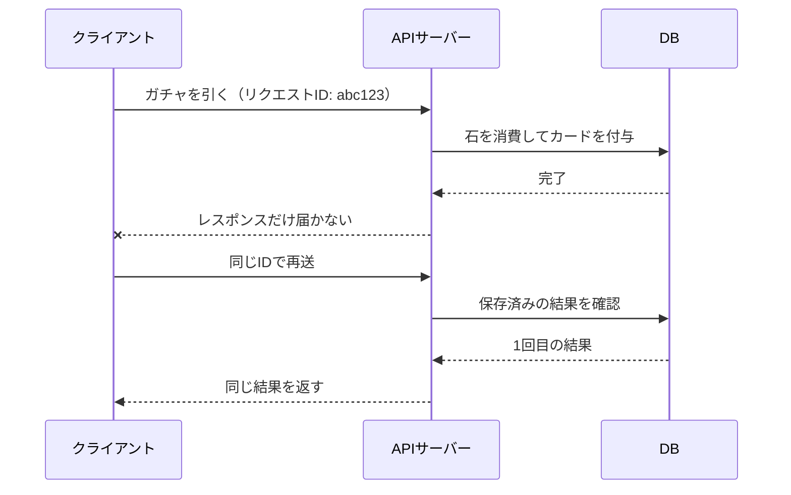

# はじめに

ゲームのサーバーサイドを4年やって、そのあとECと業務アプリを2年やって、またゲームに戻ってきました。
ずっとサーバーサイドなので、やっていること自体は何も変わっていません。
HTTPを受けてDBを触って返すだけです。

なのに戻ってきた初日から「あ、そういえばこんなに難しかったっけ」となりました。

何が難しいのかをEC側の人にうまく説明できなかったので、言語化しておきます。
主にAPIサーバー、マッチング、対戦サーバーと、それを支えるインフラの話です。

# 対象読者

- ECや業務アプリを主に携わってる人
- ゲーム案件が他サービスとどんな違いがあるか知りたい人
- 「サーバーサイドなんだからいうて変わらんでしょ」と思っている人

ゲーム側の人が読むと、たぶん新しい話は何もないです。

ここで比べるのは、自分が触ってきたモバイルゲームと、典型的な注文まわりや業務APIです。
EC・業務アプリが簡単だという話ではありません。

# 前提にする構成

まず「ゲームのサーバー」のよくあるざっくり構成を共有。
カードゲームやMOBAのようなモバイルタイトルでは、大きくAPIサーバー、マッチングサーバー、対戦サーバーの3つに分かれます。


通信方式や、リアルタイム性が必要かどうかはゲームによって異なりますが、おおよそこんな構成になることが多いです。
実際のゲーム画面でいうところの、ホーム画面、ガチャ、デッキ編成、クエスト、報酬受け取りなどを担当するのがAPIサーバーです。

なお、以下に出てくる数字は自分が見てきた範囲の感覚値です。
タイトルによって全然違うので、桁感だけ受け取ってください。

# 先に結論

ゲーム案件が複雑になる理由は、特定の言語やミドルウェアにあるわけではありません。

ECや業務アプリでは、サーバーが正しい状態を持ち、リクエストをきっかけに更新する構成が中心です。
ゲームではそこに、機能間の連鎖、クライアントとの状態共有、時刻による変化、リクエストをまたいで残り続ける状態が加わります。

ざっくりまとめると違いはこの4つかなと思います。

| 観点 | EC・業務アプリ | ゲーム |
| --- | --- | --- |
| 1回の操作が影響する範囲 | 1つの業務フローに収まりやすい | 多数のゲーム機能へ連鎖する |
| 状態の持ち主 | サーバーを正にしやすい | クライアントにも大量の状態がある |
| 状態が変わるきっかけ | 主にユーザー操作 | 操作に加えて時刻でも変わる |
| 状態の寿命 | 1リクエストで区切りやすい | 待機中や試合中も持ち続ける |

1つずつは技術的に難解な話ではありません。
この4つが同時に存在することが、ゲーム案件の難しさだと思っています。

# 1. 1回の操作が多くの機能に連鎖する（テーブルが多い）
ECの注文処理を例にしてみます。
中心になるのは注文、注文明細、在庫です。
そこにポイント、クーポン、配送先のスナップショットが加わることはありますが、処理の境界は「注文」という1つの業務フローで捉えやすい。

自分が見てきた範囲では、典型的な注文APIが3〜5テーブル程度に収まる一方、ゲームのクエストクリアでは、1リクエストで15テーブルを超えて書き換えることも珍しくありません。


この差がどこから生まれるのか、ゲームの「クエストクリア」の内訳を見てみます。

- スタミナを消費する
- クエストをクリア済みにする
- 経験値を加算し、レベルアップを判定する
- 初回クリア報酬とドロップ報酬を配る
- ミッション、シーズンパス、ランキングを進める
- プレイ履歴を残す

実際には、この1項目ずつがさらに枝分かれします。

報酬がカードなら所持カードへ、通貨なら所持通貨へといった感じです。
カードがダブっていたら別の通貨へ変換され、所持上限を超えたらプレゼントボックスへ送られる。
報酬1件を配るだけでも、動くデータは報酬の中身を見るまで確定しません。

レベルアップが発生すればスタミナが全回復して、称号が解放されて、別のミッションが進むこともあります。
1つの更新が次の更新を呼び、そこからまた別の機能へ連鎖します。

そして、これを部分的に成功させることは許されません。
「アイテムは貰えたけどミッションは進んでいない」など、関連付けが難しい要素同士での進捗共有が求められます。


ECの注文で「注文は作れたが在庫は減っていない」が許されないのと同じですが、ゲームは1回の操作が巻き込む機能の種類が多いです。
テーブル数の多さは、その結果にすぎません。
難しさの元は、独立して見える機能が1か所に合流し、すべての整合性を同時に守らなければならないことです。

特に報酬付与は、クエスト、ガチャ、ミッション、ログインボーナス、イベント交換所、お詫び配布など、ほぼすべての機能から呼ばれます。
ECの「ポイント付与」に相当するものが、ゲームでは全機能の合流点になっています。

# 2. クライアントとサーバーの境界が複雑(不正対策)

ゲームのクライアントは、ただの表示装置ではありません。
所持カード、アイテム、ミッション進捗、デッキなど、大量のユーザーデータをローカルに持ち、それを見て画面を描画します。

通信のたびに全データを取り直すとレスポンスが膨らむので、サーバーは変化したものだけを返し、クライアントがローカルの状態へ適用するということが多いです。

```json
{
  "user_status": { "level": 24, "stamina": 78 },
  "user_items":  [ { "item_id": 1001, "count": 43 } ],
  "user_missions": [ { "mission_id": 501, "progress": 3 } ]
}
```

ここでレスポンスへ含め忘れると、DBは正しいのに画面だけ古い値のまま残ります。
アプリを再起動すると最新の正しい情報に直ってしまうので、報告が上がった頃には手元で再現しないという、一見バグっぽい挙動になります。。

つまりゲームでは、サーバーとクライアントが持つ状態を常に同期させ続ける必要があります。

しかも相手はモバイル回線です。
地下鉄へ入る、エレベーターへ乗る、Wi-Fiから4Gへ切り替わる。
ガチャで石を消費した直後にレスポンスだけ届かなければ、クライアントからは石が減ったのか分かりません。

そこで同じリクエストを再送しても、処理結果が1回分にしかならないようにします。
ECでも決済などに必要な仕組みですが、ゲームではガチャ、報酬受け取り、デッキ変更など、書き込みAPI全体へ共通で入れる設計になります。



もう一つややこしいのが、クライアントは状態を持っているのに、その内容を全面的には信頼できないことです。

クエストの戦闘結果はクライアント側で計算されます。
サーバーへ送られてくるのは「クリアしました。スコア12000、残りHP340、経過時間92秒」という結果です。

一方で、消費するスタミナや報酬の抽選までクライアントへ任せるわけにはいきません。
そこはサーバーで決め、スコアや経過時間は理論値と照合して、少なくとも理論上あり得ない値を弾きます。

経過時間を検証するには、サーバー側でクエストの開始時刻を持たなければなりません。
そのためだけに「クエスト開始」というAPIが1本増えます。

クライアントには、高速に画面を描画するための状態を持たせる。
しかし通信は不安定で、送られてきた計算結果も完全には信じられない。


この不整合が、差分同期、再送対策、不正対策を他サービスよりかっちりやらないといけない要因になっています。

# 3. 時刻が状態とルールを変える

ゲームは、誰も触っていなくても状態が変わります。

スタミナは3分に1回復する。
ログインボーナスは深夜4時で日が変わり、デイリーミッションもそこでリセットされる。
イベントは決められた時刻に始まり、期間外ならAPIそのものが使えません。

スタミナ回復のために、毎分全ユーザーのデータを更新するわけにはいきません。
最後に回復した時刻だけを保存しておき、表示や消費のタイミングで経過時間から現在値を計算します。

つまり、DBに保存されている値だけでは現在の状態が決まりません。

`現在の状態 = 保存値 + 経過時間 + 現在のゲームルール`

さらにゲーム全体のルールも時刻で切り替わります。
イベント開始と同時に新カードが解禁され、能力値やドロップ率が更新されるので、クライアントは事前にルール一式をダウンロードし、そのバージョンをサーバーと揃えておく必要があります。

古いルールを持ったクライアントからリクエストが来たら、処理せずに最新版を取り直してもらいます。


不具合が出たときは、コードの問題、設定値の問題、クライアントとサーバーのバージョン違い、時刻境界の問題を切り分けるところから始まります。

しかも1リクエストの途中で基準時刻がずれると、デイリーミッションは翌日扱いなのにログインボーナスは前日扱い、という矛盾が起こります。
ゲームでは、時刻そのものが状態とルールを決める入力です。

# 4. リクエストが終わっても状態が残り続ける

ここからはAPIサーバーの外の話です。

ECの検索は、条件に合うものがなければ0件を返して終われます。
マッチングは0件で終われません。

待っているプレイヤーを保持し続け、時間が経ったらレート差の許容範囲を広げ、それでも見つからなければCPU戦へ落とす。
最初のリクエストへ答えたあとも、待機中の状態を持ちながら条件を変え続けます。

| 経過時間 | 探索するレート幅 |
| --- | --- |
| 0〜10秒 | ±100 |
| 10〜20秒 | ±200 |
| 20〜40秒 | ±400 |
| 40秒〜 | 制限なし / CPU戦 |

「レートが近い相手」と「早く始められること」のトレードオフを、同じ時間軸で運用しなければなりません。

対戦が始まると、状態の寿命はさらに長くなります。
試合の状態は数分から数十分にわたってサーバーのメモリへ残り、誰も操作していなくてもターン制限時間やゲーム内の時計で進みます。

状態を持ち続けることは、インフラの運用にも影響してきます。

| | EC・業務アプリ | 対戦サーバー |
| --- | --- | --- |
| 接続先 | 空いているサーバーへ振り分けられる | 試合を持っているサーバーに固定される |
| デプロイ | 処理中のリクエストが終われば落とせる | 試合が全部終わるまで落とせない |
| スケールイン | リクエストが止まれば落とせる | 1試合でも残っていたら落とせない |
| 台数の基準 | CPU使用率やレイテンシ | 同時接続数、試合数、メモリ |

新しいバージョンをリリースするときは、古いサーバーへの新規割り当てだけ止め、進行中の試合がすべて終わるまで待ちます。
1試合10分なら、古いサーバーも最悪10分は残ります。

マスタデータを大きく切り替えるときは、旧ルールの試合と新ルールのクライアントを混ぜないため、全部止めるのが一番安全なときもあります。
よく週次で「本日15:00〜17:00メンテナンス」というのはこういうことをやってます。

EC・業務APIの処理単位が1回のリクエストだとすれば、マッチングや対戦の処理単位は、数十秒から数十分続くセッションです。
この寿命の違いが、設計からデプロイまで全部に影響してきます。

# まとめ

ゲーム案件が難しくなる理由を振り返ると、4つありました。

- 1回の操作が多数の機能へ連鎖し、広い範囲の整合性を求められる
- クライアントにも状態と計算を持たせる一方、通信も入力も完全には信頼できない
- ユーザーが操作していなくても、時刻によって状態とルールが変わる
- マッチングや対戦が、リクエストをまたいで長時間状態を持ち続ける

どれも単体なら「まあそうだよね」で終わる話です。
難しいのは、これを全て同時に整合性を保たなければならないことだと思います。

クエストクリアAPI 1本にも、報酬やミッションへの連鎖、差分レスポンス、再送対策、ルールのバージョン、不正チェック、時刻の固定などあらゆる要素が入ってきます。

ECの注文APIと同じ感覚で書き始めると、まず終わりません。

ただし、API側の複雑さは共通の土台へ寄せることで減らせます。
差分同期、再送対策、ルールのバージョン確認、報酬付与などを、各APIが毎回考えなくてよい形にしておく。

ゲームのサーバーは「APIを作る」より、**「APIを作るための基礎設計を作る」比重と重要度が大きい**と思います。
土台さえできていれば、API 1本は驚くほど短く書けます。

一方、マッチングや対戦サーバーの状態は土台へ押し込んでも消えません。
処理の単位そのものがリクエストではないので、ステートレスなWeb APIとは設計の前提が変わります。

ゲーム案件の難しさは、使う技術が特殊だからではありません。
状態の持ち主が増え、変化のきっかけが多く、整合性を守る範囲が広く、状態が残る時間も長いからだと思っています。