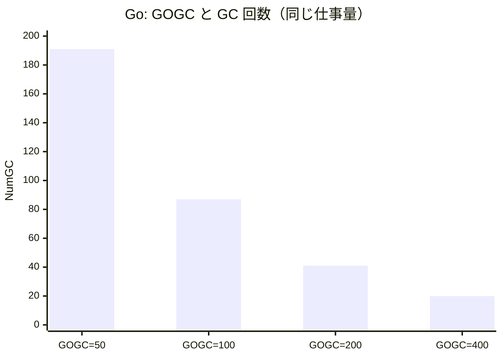

# はじめに

C#とGoはGCの設計思想がかなり違います。

- **C#（.NET）**: 世代別（generational）GC。オブジェクトを世代で分けて管理し、若い世代を頻繁・安価に回収する。
- **Go**: 非世代の**並行mark-sweep** GC。世代を持たず、到達可能な生存オブジェクト全体をたどって、アプリと並行して回収する。

この違いが実測でどう見えるのかを軸にまとめます。

# 環境

| 項目 | バージョン |
|------|-----------|
| マシン | Mac M3 |
| C# | .NET 10.0.8（Server GC + Background GC＝ASP.NET Coreの既定構成） |
| Go | go1.26.4 |

計測のために使用したコードは以下にあります。
https://github.com/Pokeyama/shimoyama-qiita-articles/tree/main/gc-benchmark

# Workstation GCとServer GC（C#の前提）

C#のGCには2つの**モード**があり、**どちらで動くかで挙動（特にGCの頻度）が変わります**。この記事のC#計測は、業務のサーバーアプリで多い**Server GC**で行いました。

| モード | 特徴 | 向き |
|--------|------|------|
| **Workstation GC** | ヒープは1つ。GCは基本、それを引き起こしたスレッドの上で動く。省メモリ・低レイテンシ寄り | デスクトップ / クライアント |
| **Server GC** | **論理CPUごとに専用ヒープとGCスレッド**を持っていて、並列でガッと回収。スループット重視・メモリ多め | サーバー / 高スループット |

重要なのは、**マシンの役割で自動的に決まるわけではなく、設定で決まる**点です。そして既定値はアプリの種類で違います。

| アプリの種類 | 既定のGC |
|---|---|
| コンソールアプリ | Workstation |
| **ASP.NET Core**（Web API / MVC） | **Server** |
| Worker Service / 汎用ホスト | Workstation（明示しない限り） |

設定はcsprojの`<ServerGarbageCollection>`、環境変数`DOTNET_gcServer`、`runtimeconfig.json`の`System.GC.Server`などで切り替わります。今どちらで動いているかは実行時に1行で確認できます。

```csharp
Console.WriteLine($"IsServerGC = {System.Runtime.GCSettings.IsServerGC}");
```

# 大前提: GCは何をしているか

GC（ガベージコレクション）は、**もう参照されていない＝今後使われないオブジェクトを自動で見つけて、そのメモリを回収する**仕組みです。手動で`free`しなくていい代わりに、ランタイムが定期的に「生きているオブジェクト」を辿り（mark）、辿れなかったものを回収します（sweep）。

ここで重要になるのが、**アロケーション（オブジェクト生成）が多いほど、GCは頻繁に走る**。ということかと思います。

# C#のGC: 世代別(generational)

## 3つの世代とLOH

.NETのGCは「**若いオブジェクトほどすぐ死ぬ**」という経験則（世代仮説）に基づき、オブジェクトを世代で分けて管理します。

| 世代 | 中身 | 回収頻度 | コスト |
|------|------|:--:|:--:|
| **Gen0** | 生まれたて | 高い | 安い（速い） |
| **Gen1** | Gen0を1回生き延びた（緩衝地帯） | 中 | 中 |
| **Gen2** | 長生き | 低い | 高い |
| **LOH** | 85,000 byte以上の大きいオブジェクト | Gen2と一緒 | 高い |

新規オブジェクトはまずGen0に置かれ、Gen0が埋まると **Gen0 GC** が走ります。そこで生き残ったものがGen1へ、さらに生き残ればGen2へ**昇格**していきます。

## 実演1: 生き残ると世代が上がる

オブジェクトがGCを生き延びるたびに世代が上がる様子を、`GC.GetGeneration()`で観察できます。

```csharp:gc-benchmark/csharp/Program.cs
var obj = new byte[100];
Console.WriteLine($"生成直後                : Gen{GC.GetGeneration(obj)}");
GC.Collect(0);  // Gen0 を回収
Console.WriteLine($"Gen0 GC を1回生き延びた : Gen{GC.GetGeneration(obj)}");
GC.Collect(1);  // Gen1 を回収
Console.WriteLine($"Gen1 GC を1回生き延びた : Gen{GC.GetGeneration(obj)}");
```

実行結果:

```text
生成直後                : Gen0
Gen0 GC を1回生き延びた : Gen1
Gen1 GC を1回生き延びた : Gen2
```

`obj`への参照が生き続けているので、GCのたびに`Gen0 → Gen1 → Gen2`と昇格しているのが分かります。

## 実演2: LOH（Large Object Heap）のしきい値

既定では**サイズが85,000 byte以上のオブジェクト**は、通常ヒープ（SOH: Small Object Heap）ではなく**LOH**に置かれ、いきなり**Gen2扱い**になります（しきい値も「Gen2扱い」も[.NET公式ドキュメント](https://learn.microsoft.com/dotnet/standard/garbage-collection/large-object-heap#how-an-object-ends-up-on-the-loh)に明記されています）。

```csharp:gc-benchmark/csharp/Program.cs
var small = new byte[84_000];
var large = new byte[85_000];
Console.WriteLine($"byte[84000]  (< 85KB) : Gen{GC.GetGeneration(small)}");
Console.WriteLine($"byte[85000]  (>=85KB) : Gen{GC.GetGeneration(large)}");
```

```text
byte[84000]  (< 85KB) : Gen0  (通常ヒープ / SOH)
byte[85000]  (>=85KB) : Gen2  (LOH = Gen2 扱い)
```

たった1,000 byteの差で、回収頻度の低いGen2行きになります。LOHは既定では**コンパクション（断片化解消の詰め直し）も行われない**ので、大きい配列を高頻度で作って捨てると断片化やメモリ肥大の温床になります。

## 実演3: アロケーション圧 → GC回数

ここが本題。**同じ仕事量でも「毎回newする」か「使い回す」かでGC回数がどれだけ変わるか**を`GC.CollectionCount()`で測ります。`new byte[64]`を1000万回作ります。

```csharp:gc-benchmark/csharp/Program.cs
// (A) 毎回 new（短命オブジェクトを大量生産）
for (int i = 0; i < N; i++)
{
    Blackhole = new byte[64];   // static フィールドへ代入してエスケープを強制
    Blackhole[0] = (byte)i;     // （ローカルのままだと JIT がアロケーションごと消す）
}

// (B) 1個を使い回す
var buf = new byte[64];
for (int i = 0; i < N; i++)
{
    buf[0] = (byte)i;
}
```

実行結果（N = 10,000,000、Server GC）:

```text
毎回 new byte[64] : Gen0=    8  Gen1=   0  Gen2=  0  alloc=   839 MB
1個を使い回し     : Gen0=    0  Gen1=   0  Gen2=  0  alloc=     0 MB
```

| パターン | Gen0 GC | Gen1 GC | Gen2 GC | アロケーション |
|---------|:--:|:--:|:--:|--:|
| 毎回new | **8回** | 0 | 0 | 839 MB |
| 使い回し | **0回** | 0 | 0 | 0 MB |

ポイントは2つです。

- **使い回すとGC回数がゼロ**（少なくともこの計測区間では）。アロケーションしなければGCは走らない。当たり前ですが。
- 毎回newした方も、**Gen0 GCだけでGen1 / Gen2は0回**。短命なゴミは全部Gen0の安い回収で消えていて、上の世代に昇格していません。**まさに世代仮説どおりの動き**で、「短命ゴミは安く片付く」のが世代別GCなのかなと思います。

### Workstation GCとの比較

冒頭で触れたGCモードの違いは、この実験で数字に出ます。**同じ839MBのアロケーション**を、GCモードだけ変えて流したときのGen0 GC回数です。

| GCモード | 毎回newのGen0 GC回数 |
|---|:--:|
| Workstation | 105回 |
| **Server** | **8回** |

Server GCは**論理CPUごとに大きなGen0ヒープ**を持つので、同じゴミ量でもGCが走る回数が1桁以上少なくなります。（その代わりメモリは多めに使う）

## 実演4: GCは世界を止める（stop-the-world）

GCには、アプリのスレッドをピタッと止める **stop-the-world (STW)の区間**があります。Background GCだと処理の大半はアプリと並行してやってくれるんですが、それでも止まる区間は残ります。.NET 9以降なら`GC.GetTotalPauseDuration()`で、その**止まってた時間の合計**が取れます。（GC全体にかかった時間ではなく、あくまで止まってた分だけ）

```text
new byte[64] を 20,000,000回: Gen0 GC 17回, GC 停止合計 4.0 ms
```

2000万回のアロケーションで、Server GCでは17回・合計4.0msぶん止まっていました（同じ処理をWorkstation GCで動かすと210回・4.7msでした）。1回あたりは短いですが、**アロケーションが多いほどこの停止が積み上がり**、レイテンシのスパイクになります。

## C# GCのチューニングポイント

- **GCモード（Workstation / Server）**: 冒頭で触れたとおり、モードでGCの頻度が大きく変わる（同じゴミ量でもServerはGen0 GCが8回、Workstationは105回）。サーバーアプリはServer GCが既定なことが多い。
- **SOHはコンパクションあり**: 通常ヒープは回収後にオブジェクトを詰め直して断片化を防ぐ（=オブジェクトのアドレスは動く）。一方 **LOHは既定で非圧縮**。
- 結局のところ、**アロケーションを減らす**のがメインになってくるのかなと思います。

# GoのGC: 非世代の並行mark-sweep

## 設計思想がそもそも違う

GoのGCはC#とかなり違います。

- **世代を持たない**。Gen0/1/2のような区別はなく、若い領域だけに絞らず、根（roots）から到達できる**生存オブジェクトのグラフ全体**をマークする。
- **並行（concurrent）**。マーキングの大半をアプリと**並行して**実行し、stop-the-worldはごく短い区間だけ。設計目標が「**低レイテンシ**（短い停止時間）」に振られている。
- **非移動（non-moving）**。回収後にオブジェクトを詰め直さない（コンパクションしない）。サイズクラス別アロケータで断片化を抑える方針。

その代わり、GCをいつ走らせるかは **`GOGC`** というシンプルなノブで決まります。

> **GOGC=100（既定）**: ざっくり「前回GC後の生存ヒープが**2倍**に増えたら次のGC」。

ざっくりはこれでOKなんですが、実はGo 1.18以降はもうちょい細かくて、rootも込みで`Live heap + (Live heap + GC roots) × GOGC / 100`あたりが次の目標サイズになります（詳しくは[Go GC Guide](https://go.dev/doc/gc-guide)）。

## 実演1: アロケーション圧 → GC回数

C#と同じ実験をGoでも。`runtime.MemStats`の`NumGC`（GC回数）と`PauseTotalNs`（累計停止時間）を測ります。

```go:gc-benchmark/go/main.go
// (A) 毎回 make
for i := 0; i < N; i++ {
    blackhole = make([]byte, 64) // パッケージ変数へ代入してエスケープを強制
    blackhole[0] = byte(i)
}

// (B) 1個を使い回す
buf := make([]byte, 64)
for i := 0; i < N; i++ {
    buf[0] = byte(i)
}
```

ある実行例（N = 10,000,000）:

```text
毎回 make([]byte,64): NumGC= 171  GC停止合計=   5.0 ms  TotalAlloc=  610 MB
1個を使い回し       : NumGC=   0  GC停止合計=   0.0 ms  TotalAlloc=    0 MB
```

C#と同じく、**使い回せばGCはゼロ**（これもこの区間での話ですが）。アロケーションがGCを駆動するのは両言語共通です。

ただし中身は違います。C#側は世代別なので、増えた分は**安いGen0 GC**だけで片付いていました（Server GCで8回、WorkstationでもGen0のみでGen1/Gen2は0）。一方Goの171回前後は世代がなく、**毎回、生存グラフ全体を対象にしたGC**です（その代わり並行実行で停止は短い）。「世代別で安く済ます」C#と「並行で止めずに済ます」Go、というアプローチの違いが出てますね。

## 実演2: GOGCのトレードオフ

同じ仕事量（500万回のmake）で、`GOGC`だけを変えてみます。

```go:gc-benchmark/go/main.go
for _, pct := range []int{50, 100, 200, 400} {
    debug.SetGCPercent(pct)
    // ... 500万回 make して NumGC と停止時間を測る
}
```

ある実行例:

```text
GOGC=  50 : NumGC= 191  GC停止合計=   4.8 ms
GOGC= 100 : NumGC=  87  GC停止合計=   2.3 ms
GOGC= 200 : NumGC=  41  GC停止合計=   1.0 ms
GOGC= 400 : NumGC=  20  GC停止合計=   0.5 ms
```

| GOGC | GC回数 | GC停止合計 | 性格 |
|:--:|:--:|:--:|------|
| 50 | 191回 | 4.8 ms | こまめに回収・メモリ節約・CPU多め |
| 100（既定） | 87回 | 2.3 ms | バランス |
| 200 | 41回 | 1.0 ms | GCを減らす・メモリ多め |
| 400 | 20回 | 0.5 ms | さらにGCを減らす・メモリさらに多め |



GOGCを2倍にするたびにGC回数がほぼ半分になっています。「**メモリを多めに使う代わりにGCを減らしてCPUを浮かせる**」という調整が、ノブ1つでできるのがGoの特徴です。メモリ上限を直接決めたい場合は **`GOMEMLIMIT`**（Go 1.19+のソフトリミット）も使えます。

## 実演3: gctraceでGCを生で見る

`GODEBUG=gctrace=1`を付けて実行すると、GCのたびに1行ログが出ます。

```bash
GODEBUG=gctrace=1 go run .
```

実際の出力（抜粋）:

```text
gc 2 @0.001s 3%: 0.009+0.066+0.014 ms clock, ..., 3->3->0 MB, 4 MB goal, ..., 10 P
gc 3 @0.002s 2%: 0.008+0.20+0.011 ms clock, ..., 3->4->0 MB, 4 MB goal, ..., 10 P
gc 4 @0.003s 3%: 0.008+4.6+0.23 ms clock, ..., 3->4->0 MB, 4 MB goal, ..., 10 P
```

読み方の要点:

- `gc 4` … 4回目のGC
- `0.008+4.6+0.23 ms clock` … **STW(sweep終了)＋並行マーク＋STW(mark終了)** の各時間。**長い4.6msの部分は並行実行**なので、アプリが完全に止まるのは前後の`0.008`と`0.23` msだけ。
- `3->4->0 MB` … GC開始時ヒープ → 終了時 → 生存サイズ。**生存が（MB表示で）0**なので、作ったものがほぼ全部ゴミ＝短命だったと分かる。
- `4 MB goal` … GOGCから決まったGCを起こすヒープサイズの目標。

「重い処理は並行でやって、世界を止めるのは前後のわずかな区間だけ」というGo GCの設計が、ログからも読み取れます。

# C#とGoのGCまとめ

| 観点 | C#（.NET） | Go |
|------|-----------|-----|
| 世代 | **あり**（Gen0/1/2 + LOH） | **なし**（生存グラフ全体をマーク） |
| 回収方式 | mark-sweep（SOHは通常compact、LOHは通常非compact） | 並行mark-sweep（**非移動**） |
| 停止(STW) | 世代を分けて停止を短く | 並行実行で停止を極小に |
| 主なチューニング | Workstation/Server GC、アロケーション削減 | **GOGC** / **GOMEMLIMIT** |
| 思想 | 短命ゴミを**安く**片付ける | 止めずに**並行で**片付ける |

# 計測でわかったこと

- **両言語に共通**: アロケーションがGCを駆動する。**使い回してアロケーションをなくせば、今回の計測区間ではGCがゼロ**になった。
- **C#**: 短命なゴミはGen0で安く死ぬ（今回Gen1/Gen2は0回）。気をつけるのは**長生きするオブジェクト**（Gen2）と**85KB以上のLOH行き**。
- **Go**: GC回数は **GOGC** で素直にコントロールできる。停止時間は並行実行で短いが、頻発すればCPUを食う。メモリとCPUのトレードオフをGOGC/GOMEMLIMITで設定する。

# まとめ
雰囲気で理解してたGCについてざっくりですが理解できた気がします。
実際に計測までしてみると言語ごとに違いがあっておもしろいですね。
このレベルでチューニングが実務で必要になるかは置いておくとしても、知識として持っておくことでコーディングの仕方も変わりそうです。

## 参考

- [.NETのガベージ コレクションの基礎](https://learn.microsoft.com/dotnet/standard/garbage-collection/fundamentals)
- [Large object heap (LOH) — How an object ends up on the LOH](https://learn.microsoft.com/dotnet/standard/garbage-collection/large-object-heap#how-an-object-ends-up-on-the-loh)
- [A Guide to the Go Garbage Collector](https://go.dev/doc/gc-guide)
- [runtimeパッケージ(MemStats)](https://pkg.go.dev/runtime#MemStats)
