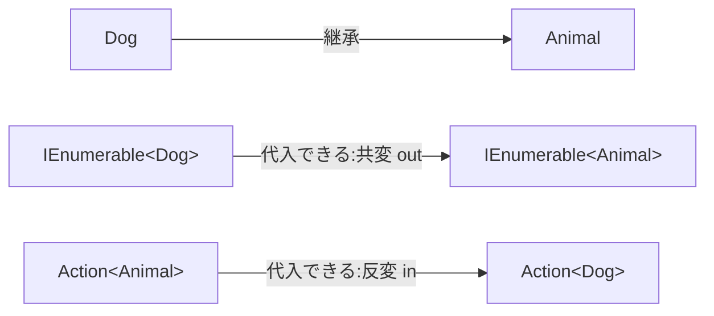

# はじめに
直近の案件では、状態を持つ型をイミュータブルに保つ方針で書いています。
戻り値やDTOは`sealed record`にして、コレクションは`IReadOnlyList<T>`や`IReadOnlyCollection<T>`で受け渡します。

で、その`IReadOnlyList<T>`の定義に飛んだら`IReadOnlyList<out T>`と書いてあって、イミュータブルを徹底したいのに`out`を書いていいのか、そもそも`out`って出力用じゃないのか、というところで引っかかりました。

自分は参照渡しの`ref`と`out`の記事を書いたことがあります。

https://qiita.com/simoyama2323/items/2c8facc210743db60914

同じ`out`ですが完全に別物というか、調べていくほどに混乱してきたので学習したものをまとめます。
共変性・反変性という用語でも説明できず、「参照渡しの`ref`や`in`よりは安全そう」くらいの理解のまま何年も使っていた自戒もこめて。

# 環境
.NET SDK 10.0.300
macOS
以下のエラー文は全部、実際にコンパイルして出たものを貼っています。

# List<Dog>はList<Animal>に入らない
こういう型があるとします。

```csharp
public abstract record Animal;
public sealed record Dog : Animal;
public sealed record Cat : Animal;
```

`Dog`は`Animal`なので、`Dog`のリストは`Animal`のリストとして扱えそうな気がしますよね。
通りません。

```csharp
var dogs = new List<Dog> { new Dog() };

List<Animal> animals = dogs;
// error CS0029: Cannot implicitly convert type 'System.Collections.Generic.List<Dog>' to 'System.Collections.Generic.List<Animal>'
```

`ICollection<Animal>`で受けても同じです。

```csharp
ICollection<Animal> animals = dogs;
// error CS0266: Cannot implicitly convert type 'System.Collections.Generic.List<Dog>' to 'System.Collections.Generic.ICollection<Animal>'. An explicit conversion exists (are you missing a cast?)
```

ところが`IEnumerable<Animal>`にすると何も言われずに通ります。

```csharp
IEnumerable<Animal> animals = dogs;     // 通る
IReadOnlyList<Animal> animals2 = dogs;  // これも通る
```

同じ`List<Dog>`を渡しているのに、受け側の型で結果が変わります。
うん？？？？

# なぜIEnumerable<T>なら入るのか
危ないほうから考えると分かりやすいです。
仮に`List<Animal> animals = dogs;`が通るとしたら、こう書けてしまいます。

```csharp
List<Animal> animals = dogs; // 通ると仮定する（本当はエラー）
animals.Add(new Cat());      // Animalのリストなので合法
```

`animals`と`dogs`は同じインスタンスなので、`List<Dog>`の中に`Cat`が入ります。
だめですよね。

危ないのは`Add(T)`のように、`T`を引数で受け取る場所（入力位置）です。
`List<T>`や`ICollection<T>`はこれを持っているので、代入ごと禁止されています。

逆に、`T`が戻り値として出てくる場所（出力位置）しかない型なら、この事故は起こりようがありません。

```csharp
IEnumerable<Animal> animals = dogs; // 通る

foreach (var animal in animals)
{
    // 出てくるのは実体としては全部Dog
    // DogはAnimalなので、Animalとして扱える
}
```

`IEnumerable<T>`や`IReadOnlyList<T>`に`Add`はなく、`T`は出てくるだけです。
出てくるものが全部`Dog`なら、それを`Animal`として受け取っても何も困りません。

この「`T`は出力位置にしか使いません」をコンパイラに約束するキーワードが`out`です。
約束できた型だけ、型引数を派生型から基底型の向きに代入できるようになります。

これが共変性で、C# 4.0で入りました。



共変は継承と同じ向き、反変は逆向きです。
反変については後述します。

約束なので、破るとちゃんと怒られます。
インターフェースで試すと分かりやすいです。

```csharp
public interface IBox<out T>
{
    T Take();           // 出力位置。これだけなら通る
    void Put(T item);   // 入力位置。ここで落ちる
}
// error CS1961: Invalid variance: The type parameter 'T' must be contravariantly valid on 'IBox<T>.Put(T)'. 'T' is covariant.
```

`T Take();`だけのときはビルドが通ります。
`void Put(T item);`を1行足した瞬間にCS1961です。

`out`は**読み取り専用にした型にしか付けられません**。

## 知らないまま使っていた
仕事のコードにそのまま出てきていました。

ミッションの達成判定サービスがあって、ゲーム内の出来事は`MissionEvent`を基底とする継承階層で表しています。
実際のコードの超簡略版が以下です。

```csharp
public abstract record MissionEvent;
public sealed record RewardGrantedMissionEvent : MissionEvent;

public interface IMissionService
{
    ValueTask<MissionEvaluationResult> EvaluateAsync(
        Guid playerId,
        IReadOnlyCollection<MissionEvent> missionEvents);
}
```

呼び出し側は`List<RewardGrantedMissionEvent>`をそのまま渡しています。
これが通っていたのは`IReadOnlyCollection<out T>`が共変だからで、引数を`ICollection<MissionEvent>`に変えると即座に止まります。

```csharp
// void Evaluate(ICollection<MissionEvent> events) だった場合
Evaluate(events);
// error CS1503: Argument 1: cannot convert from 'System.Collections.Generic.List<RewardGrantedMissionEvent>' to 'System.Collections.Generic.ICollection<MissionEvent>'
```

自分はこれを説明できないまま毎日書いていました。

そして最初の疑問の答えですが、順番が逆でした。

イミュータブルなのに`out`が付いているのではなく、**イミュータブル（出力専用）だから`out`を付けられる**が正しい。
読み取り専用で設計したから共変にできる、という関係です。

# 反変（in）は向きが逆
`out`の逆が`in`で、`T`を引数にしか使わない型に付きます。
デリゲートの共変・反変は実務で書いたことがなかったんですが、せっかくなので試しました。

```csharp
Action<Animal> animalAction = a => Console.WriteLine(a);
Action<Dog> dogAction = animalAction; // 通る
```

`Action<Animal>`は`Animal`を受け取って処理するデリゲートで、`Animal`を処理できるものは当然`Dog`も処理できるので、基底型から派生型の向きに代入できるわけですね。

逆向きは通りません。

```csharp
Action<Dog> dogAction = d => Console.WriteLine(d);
Action<Animal> animalAction = dogAction;
// error CS0266: Cannot implicitly convert type 'System.Action<Dog>' to 'System.Action<Animal>'. An explicit conversion exists (are you missing a cast?)
```

`Func`のほうは`T`が戻り値なので`Func<out TResult>`、つまり共変です。

```csharp
Func<Dog> dogFactory = () => new Dog();
Func<Animal> animalFactory = dogFactory; // 通る
```

ここまでを整理すると3種類しかありません。

| | キーワード | Tを使える位置 | 代入できる向き | 代表的な型 |
| --- | --- | --- | --- | --- |
| 不変 | なし | 入力にも出力にも | 同じ型だけ | `List<T>` `ICollection<T>` |
| 共変 | `out T` | 出力（戻り値）だけ | 派生型→基底型 | `IEnumerable<out T>` `IReadOnlyList<out T>` `Func<out TResult>` |
| 反変 | `in T` | 入力（引数）だけ | 基底型→派生型 | `Action<in T>` |

# 配列は昔からゆるい
ここまでのエラーは全部コンパイル時に出ます。
配列だけは共変なのにコンパイラが止めてくれません。

```csharp
Animal[] array = new Dog[1];
array[0] = new Cat();
// System.ArrayTypeMismatchException: Attempted to access an element as a type incompatible with the array.
```

ジェネリクスの分散指定はC# 4.0で入りましたが、配列の共変性は.NET 1.0時代からある仕様です。
代わりに、要素を書き込むたび実行時の型チェックが回っています。

# まとめ
調べた結果、自分の書き方が変わるところは特にありませんでした。
`IEnumerable<T>`も`IReadOnlyList<T>`もBCL側が`out`を付けてくれているので、イミュータブル方針で書いていれば何もしなくても共変の代入が使えます。

自作のインターフェースに`out`を付けるかどうかは、読み取り専用で確定しているかだけで決めればいいと思います。

取得系だけのつもりで`out`を付けた型に、あとから登録系のメソッドを足したくなっても、CS1961が出て足せません。
公開済みのインターフェースだと、`out`を外すときに共変の代入をしている呼び出し側まで壊れます。

`in`は自分で書く場面が思いつきませんでした。
デリゲートを受け取る自作のAPIを設計するならありそうですが、そこまでの必要に迫られたことはないです。

あと、参照渡しの`ref`/`out`/`in`とは名前が同じだけで無関係です。

自分はここを混同していたせいで、`IReadOnlyList<out T>`を見るたびに毎回引っかかっていました。
別物だと分けられただけで、だいぶすっきりしました。
