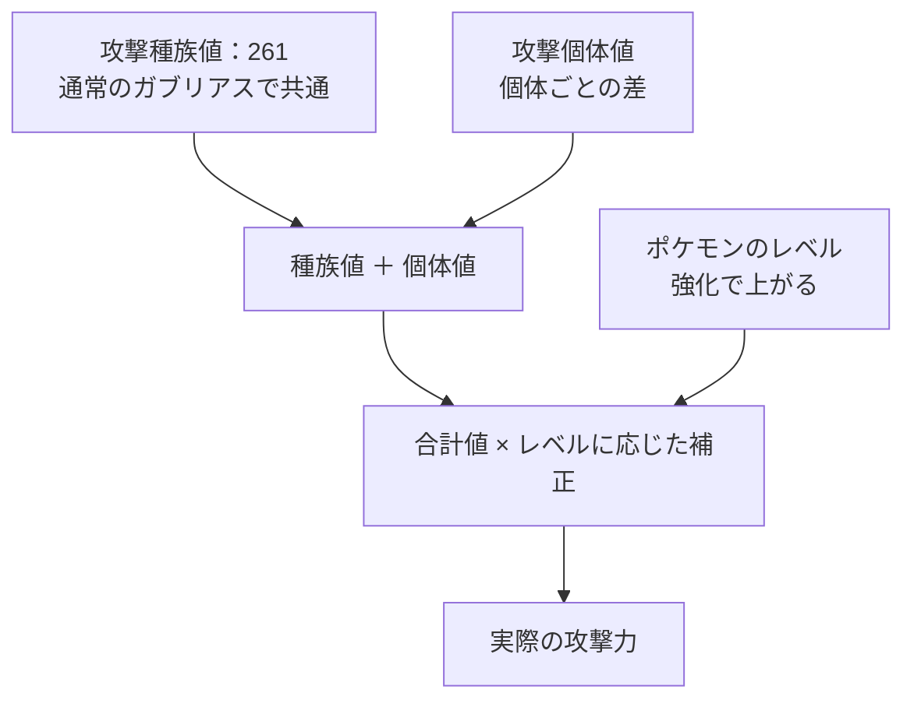

# はじめに
ポケモンGOの種族値ってみなさんしっかり説明できるでしょうか
自分はおおよそ原作の「こうげき・とくこう」と「ぼうぎょ・とくぼう」がいい感じに合算されて、「すばやさ」がいい感じに割り振られてそうって認識でいました。
そこをしっかり理解すると今後の新ポケモンとかでも名前だけである程度性能が予想できるようになると思うので言語化してみます。

# おことわり
この記事での強いという表現はジム・レイド戦の場合になります。
レベルも考慮していません。
PvPではレベルを含む別の係数が掛けられており、とても複雑なので割愛します。

# 種族値とは
そもそも種族値とは、**ポケモンの種類ごとに決まっている能力の基礎値**です。
同じポケモンであれば共通で、捕まえた個体や育て具合によって変わるものではありません。

原作ではHP・こうげき・ぼうぎょ・とくこう・とくぼう・すばやさに分かれていますが、ポケモンGOではHP・攻撃・防御で表されます。
攻撃が高いポケモンなのか、耐久に寄ったポケモンなのか、といった性能の土台になる部分ですね。

## 例

例えばガブリアスの~~作為的~~美しい種族値

メーターは右端を255として表示しています。

| 能力 | 原作（ポケモンSV） |
| --- | --- |
| HP | `█████████████▌░░░░░░░░░░░░░░░░░░` 108 |
| こうげき | `████████████████▍░░░░░░░░░░░░░░░` 130 |
| ぼうぎょ | `███████████▉░░░░░░░░░░░░░░░░░░░░` 95 |
| とくこう | `██████████░░░░░░░░░░░░░░░░░░░░░░` 80 |
| とくぼう | `██████████▋░░░░░░░░░░░░░░░░░░░░░` 85 |
| すばやさ | `████████████▊░░░░░░░░░░░░░░░░░░░` 102 |

公式のポケモンずかんと比較するとほぼ同じようになっており、公式サイドもこの数値を**ポケモンの種族ごとの強さ**としていることがわかります。

https://zukan.pokemon.co.jp/detail/0445

## 個体値・レベルとの違い

よく厳選で話題になる個体値は、同じ種類の中での個体ごとの差です。
例えば、通常のガブリアス同士なら上の表の種族値は共通ですが、個体値には違いがあります。
ポケモンGOの「ポケモンを調べてもらう」で評価されるのはこちらです。

実際の能力値は、種族値に個体値を加え、ポケモンのレベルに応じた補正をかけて決まります。
強化で能力が上がるのも、種族値そのものが増えているのではなく、レベルが上がるためです。

ガブリアスの攻撃を例にすると、以下のような関係になります。

種族値が同じでも、個体値やレベルが違えば実際の攻撃力は変わります。

https://pokemongo.gamewith.jp/article/show/35348

今回はこの土台となる種族値が、原作からポケモンGOへどう変換されているのかを見ていきます。
