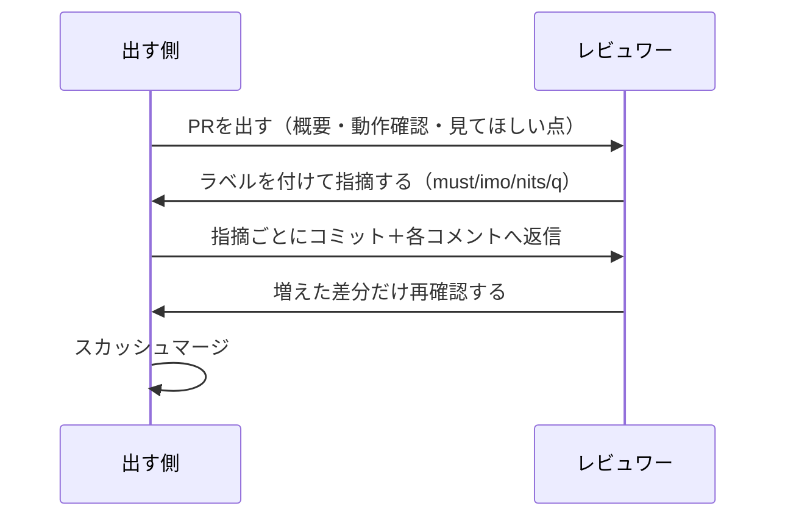

# はじめに
弊社の一部案件がGitHubへ移行したのでPR開発を取り入れてみました。

というのも、今まで差分で見る機会が少なかったようで、レビューコメントもコード上に付けず、Backlogの課題コメントで返していました。
毎回ファイル全体を見ていたのでそこを改善したいなと思った次第です。
また、レビューの仕方が人によって違っていたのでそこを一般化したかったのもあります。

個人的な話になりますが、前職でがっつりPRベースの開発をしていて、他チームからもレビュー依頼が飛んでくる環境だったので、やってきた形をそのまま持ち込んでみました。

やり取りの流れはこんな感じです。



PRでこれから開発しようと思ってる〜という方々の参考になればと思います。
すでにPRで開発されている方々には特に目新しい情報はないです。

# 導入したこと
- PRという概念
- 差分を見るという観点
- レビュワーに優しくなろうという心遣い
- 経験の浅いメンバーのレビューによる教育機会
- CI

# 導入に伴った障壁
今現在も走り始めで壁を感じているところではありますが、気にしていることを。

## GitHubに慣れてもらう
そもそも「PRって何？」という状況だったので、資料を作成し展開しました。
GitHubのUIにも慣れてもらう必要があったので、PRレビューに不慣れなメンバーにもレビュー依頼を積極的にアサインしています。

## 差分を見るという観点
今まではレビュー依頼が来たらレビュワーが該当箇所を探して全体を見ながらのレビューでした。
もちろん全体を考えてレビューはして然るべきですが、少なくとも今回の変更範囲はレビュイーが提示するべきですし、それを一発で見られるのがFiles changedタブです。
「レビューしやすいですか？」と聞いても、メンバーからはUIの不慣れも併せて当初は喉に小骨が引っかかった感じでした。

この辺は今後の慣れでどうにかなる部分ではあるかなと思っています。
引き続き色々な方にアサインしていこうと思っています。

## CIよくわからんと言われた
当社でもCloud Buildを利用したCDによる自動デプロイなどは日頃から活用していたのですが、構築や保守は属人的でした。
また、形式的にCIというものを導入したことがなかったので、GitHub ActionsでのCIを本格導入しました。

ですが、こちらも「そもそもCIって？」というところから説明が必要で資料を作成し展開しました。

PRのたびに自動テストやLintなどの最低限のことしか導入していませんが、当初は前述のUIへの不慣れもあり少し反発がありました。

この辺の利点が見えてくるのは開発中期〜運用開始後〜だと思うので、絶賛壁と格闘中です。

# PR
PR開発を導入したことに伴って気をつけていることを書き連ねます。

## PRの粒度
前職で一番言われたのが粒度でした。
「1PRはレビュワーが見やすい単位」という考えで、大きすぎると出す前に差し戻されていました。

自分はCMSの更新とAPIの更新を同じPRに入れて差し戻されたことがあります。
行数の問題ではなくて、別の変更が2つ混ざっていると、レビュワーは文脈を行き来しながら読むことになるからです。

とはいえ人によって見やすい量というのは違うので、行数よりも、1つの目的・文脈で説明できるかを優先し、現状は参考値として1000行以内を見ています。

機能単位で切ると超えることもあるので、ここは正直まだ探り中です。

## PR概要テンプレを作った
テンプレートの中身はこれだけです。

```markdown
### 概要【必須】

### Backlog課題【必須】

### 変更内容（任意）

### 動作確認（任意）

### レビューしてほしい点（任意）

### 備考（任意）
```
必須にしたのは概要とBacklogの課題リンクの2つで、あとは任意にしました。
※弊社ではBacklogで課題を管理しているので、1課題1PRで運用しています。（していきたい）

基本的に1:1は必ず紐づけるようにして課題を追いやすくしています。

埋めるとこうなります。


レビューしてもらいたい観点をこれで統一できたので、書いておいてよかったと思っています。

CIで確認できる変更では任意とし、CIで担保できない変更では動作確認の手順と結果を書いてもらっています。

## 指摘の仕方
指摘の仕方も各々バラバラだったのでこの機会に統一しました。（まだしてない）
コメントの頭に`[must]`のようなラベルを付けます。

| ラベル | 意味 | 残っているとマージできるか |
| --- | --- | --- |
| `[must]` | 直してほしい。直るまでapproveしない | できない |
| `[imo]` | 自分の意見・提案 | できる |
| `[nits]` | 細かい指摘。対応は任意 | できる |
| `[q]` | 質問。修正要求ではない | できる |
| `[info]` | 情報共有 | できる |

ラベルがないと受け取った側はコメント全部を「直せと言われている」と読みますし、書く側も`[must]`と打つ前に「これ直してもらうほどか？」と一度考えることになるので、`[imo]`に落とすことがよくあります。

### must

`[must]`のときに気をつけているのは、指摘の範囲を限定することです。
実際に指摘したのは以下でした（コードは実物から少し変えています）。

```csharp
    let value = (int)Enum.Parse(enumType, name)
```

> #### 実際にした指摘
>[must]キャストの仕方がちょい甘い。`Convert.ToInt64`でキャストしないと`long`とかきたとき動かなくなるかもです ※(int)を今後使うなといってるわけではないです

あきらかに今後動かなくなりそうな部分には`[must]`で指摘します。


### 引用を積極的に使う
直し方が既存コードにあるときは、その行のURLを貼って「〜と同じ形にするとよさげです」まで書きます。
GitHubはコメントに行のパーマリンクを貼ると、その場にコードを埋め込んで表示してくれます。


> #### 実際にした指摘
> [must]本番でも叩けてしまう。ユーザーから叩けたらまずいエンドポイントなのでなにかしらガードしておきましょうか

実際のPRでこのとき引用したのは、既存の内部専用エンドポイントに入っていたこういうガードです（実物から少し変えています）。

```csharp
// 内部ネットワーク以外からのアクセスは弾く
if (!ServerConfig.IsInternalAccess(HttpContext)) throw new BadHttpRequestException("Internal only.");
```

探すところから相手にやらせると返信までの時間が延びるので、既存コードの場所が分かっているなら自分で書いてしまったほうが早いです。

`[must]`のスレッドは、指摘、確認結果の報告、修正で閉じます。

### nits
対応してもしなくてもいい細かい指摘は`[nits]`にします。

> #### 実際にした指摘
> [nits]このスクリプト、`./scripts`以下に移動しておきましょうか。ツール系はここにまとめておきたい所存です

任意とはいえ、移動先とそうしたい理由までは書きます。
「どこかへ移動して」だけだと、相手は意図を推測しながら直すことになるので。

### info
修正を求めない共有は`[info]`にします。

> #### 実際にした指摘
> [info]このプロジェクトではpublicなメソッドにdocコメントを書く方針です

指摘というより、チームでこう書いていきたいという表明に近い使い方です。

### よかったところは褒める
良いところはラベルなしで褒めます。

```csharp
var descriptions = (from name in Enum.GetNames(enumType)
    let value = (int)Enum.Parse(enumType, name)
    let summary = FindDocComment(xmlDoc, enumType, name)
    select $"{value} = {name}{(summary is null ? "" : $" ({summary})")}").ToList();
```

> #### 実際にした褒め
> こっちの構文のLINQうまく使えてるの初めてみました すごい

指摘だけ流れてくるPRはしんどいので、こういうのを1個は書くようにしています。（しましょう）

### q
質問は`[q]`です。


例えば以下のような部分があったのですが、なぜ`setInterval`を使っているのかコードからは読み取れなかったので聞いてみました。

```javascript
setInterval(processRedocTable, 1000);
```

> [q]これってReDocの描画を待つため、という認識で合ってます？

レビュイーから質問の答えが返ってきたら終わりです。

### 指摘は断ってもいい
ラベルをつけることでレビュイーは指摘の重さを明確に理解できます。
`[imo]`と`[nits]`はもともと断られる前提のラベルです。

「既存と揃えたいので今回はこのまま」のように理由が1行あれば、「了解です」で終わります。


## コミット粒度
GitHubはコミットハッシュを貼ることで簡単にリンクにしてくれます。
レビュー対応は指摘ごとにコミットを分けて、指摘コメントそれぞれに返信をもらえるようにしました。（したい）


指摘と修正の差分が1:1で対応するとレビュワーも指摘が対応された部分だけ確認すればいいので楽になります。
これはPRというより普段のレビューから気をつけるべきことですが。

## リアクションは積極的につけよう
コメントを読んだら、リアクションだけでも付けておくと伝わります。
返信を書くほどでもないコメントも、絵文字が1個あれば「読んだ」が相手に見えます。


絵文字に抵抗がある方でもリアクションをつけることで、レビュー時のレビュイーが感じる心理的負担を軽減できます。
かわいいですし。

## 対応済みは解決して閉じる
対応が終わったスレッドは「Resolve conversation」で閉じます。


閉じたスレッドは畳まれます。
未対応の指摘がどれだけ残っているかは、開いているスレッドを数えれば分かります。


## マージはスカッシュで
これも普段から気をつけるべきことな気がしますが、GitHub上のマージ方式は「Squash and merge」で統一しました。


指摘ごとにコミットを積む運用だと、マージまでにコミットがどんどん増えます。
「Squash and merge」なら何コミット積んでもマージのときに1つにまとめられるので、`main`には課題単位のコミットだけが残ります。

## ApproveしたらLGTMする
マージを承認したらLGTMの掛け声と共にLGTM画像を貼るようにしました。


こういうコミュニケーションが日頃から行われていれば相談しやすい環境になりやすいと思います。

# 今後やっていきたいこと

## レビュワーアサインの通知
GitHubの通知機能は普段から見てる人じゃないと気づきづらい感があるので、Slackのチームチャンネルで通知しようと思っています。
みんなが見えるところに通知するのが重要かと思います。

## AIでの自動レビュー
これも前職で非常に助けられたのですが、PRにプッシュするたびにLLMがレビューしてコメントを書いてくれる機能を追加しようと思っています。
あらかじめAIにレビューさせてPRのタイムラインに載せておくことで、レビュワーはすでに指摘済みの観点を共有できるので負担が減ります。

## 若手にもレビューしてもらう
弊社ではレビューは基本的に管理職相当の方々が行うのが暗黙の了解だったのですが、今後は若手の人にも積極的にやってもらいたいと思っています。
というのもレビューで使う筋肉は、書いているだけじゃ付かない部分だと思っているので早めに経験してほしいなと思ってます。
テックリード相当の人材を早く作りたいという思惑もありけり。

# まとめ
前職でやっていた形をそのまま持ち込んでみましたが、GitHubやCIに慣れていないメンバーには、やり方だけでなく意図も含めて説明しないと定着しないと感じています。

目的はPRを使うこと自体ではなく、出す側と見る側が迷わずやり取りできる形を作ることです。
テンプレートや指摘ラベルのような小さな決め事でも、レビュワーが見るべきところとレビュイーが対応するべきところが分かりやすくなります。

まだまだ導入初期なので、メンバーのフォローを続けながら、チームに合った形で問題なく運用できるところまで持っていければと思います。
