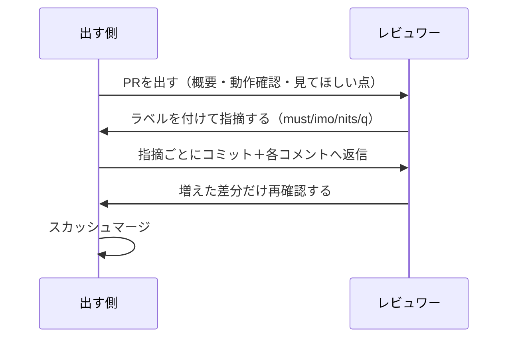

# はじめに
出戻りで今のチームに戻ってきたら、PRでレビューをする文化がありませんでした。

gitflowで開発していて、そもそも差分を見る機会が少なかったようで、レビューコメントもコード上に付けず、Backlogの課題コメントで返していました。

そうなるとレビューの仕方が人によって変わります。
自分は前職でがっつりPRベースの開発をしていて、他チームからもレビュー依頼が飛んでくる環境だったので、やってきた形をそのまま持ち込んでみました。

やり取りの流れはこんな感じです。



PRでこれから開発しようと思ってる〜という方々の参考になればと思います。
すでにPRで開発されている方々には当たり前のことしか書いてないです。

# 持ち込んだもの
PRのテンプレートは自分で書いてリポジトリに置きました。
指摘に付けるラベルは、前職のテックリードが使っていたものをそのまま真似しています。

マージ方式は「rebaseはせず、スカッシュマージにする」と一応チームで決めました。
これはコミットの話と関わるので後半に書きます。

# PRの粒度
前職で一番言われたのが粒度でした。
「1PRはレビュワーが見やすい単位」という考えで、大きすぎると出す前に差し戻されます。

自分はCMSの更新とAPIの更新を同じPRに入れて差し戻されたことがあります。
行数の問題ではなくて、別の変更が2つ混ざっていると、レビュワーは文脈を行き来しながら読むことになるからです。

とはいえ見やすい単位が何行なのかは人によるので、いまは1000行以内を目安にしていますが、これは自分の感覚でしかないですし、チームで合意した数字でもないです。

機能単位で切ると超えることもあるので、ここは正直まだ探り中です。

一番うまく回ったPRは`+981/-25`行の11ファイルで、レビューコメントは18件付いて、オープンからマージまで2日でした。

1000行近くあってレビューが2日で終わったのは、概要が書いてあったからだと思っています。

# 概要はテンプレで書く
テンプレートの中身はこれだけです。

```markdown
### 概要【必須】

### Backlog課題【必須】

### 変更内容（任意）

### 動作確認（任意）

### レビューしてほしい点（任意）

### 備考（任意）
```

テンプレを作った動機は「テンプレあったほうがわかりやすいじゃんね」くらいの雑なものです。
必須にしたのは概要とBacklogの課題リンクの2つで、あとは任意にしました。

課題リンクを必須にしたのは、課題はBacklog、実装はPRと分けているからです。
GitHubのissueは期限が持てなくて使いづらかったので使っておらず、Backlogを実質issueとして使っています。

埋めるとこうなります。


テンプレを作っておいてよかったのは、変更内容の欄にやったことだけでなく**やらなかったこと**まで書いてもらえたことです。
消したコードとその理由が1行あるだけで、差分のマイナス側を追う必要がなくなります。

動作確認は、結果ではなく再現できる手順で書いてあると自分の手元で試せますし、「レビューしてほしい点」に不安な箇所を先に書いてもらえると、そこから読み始められます。

# レビュー依頼はどう知らせる？
ここはまだ定まっていません。

いまはChatworkやBacklogでメンションを付けて「PR出したので見てください」と声をかけています。
ただ、GitHubの外で毎回声をかけるのはやめたいと思っています。

GitHubにはreviewerに指定されると通知が飛ぶ仕組みがあるので、本来はそれで済む話です。
いまはSlackと連携させて、レビュー依頼をSlackの通知に出す形にしようとしているところです。

# 指摘の仕方
コメントの頭に`[must]`のようなラベルを付けます。

| ラベル | 意味 | 残っているとマージできるか |
| --- | --- | --- |
| `[must]` | 直してほしい。直るまでapproveしない | できない |
| `[imo]` | 自分の意見・提案 | できる |
| `[nits]` | 細かい指摘。対応は任意 | できる |
| `[q]` | 質問。修正要求ではない | できる |
| `[info]` | 情報共有 | できる |

ラベルがないと受け取った側はコメント全部を「直せと言われている」と読みますし、書く側も`[must]`と打つ前に「これ直してもらうほどか？」と一度考えることになるので、`[imo]`に落とすことがよくあります。

## must

`[must]`のときに気をつけているのは、指摘の範囲を限定することです。
実際に指摘したのは以下でした（コードは実物から少し変えています）。

```csharp
    let value = (int)Enum.Parse(enumType, name)
```

> [must]キャストの仕方がちょい甘い。`Convert.ToInt64`でキャストしないと`long`とかきたとき動かなくなるかもです ※(int)を今後使うなといってるわけではないです

あきらかに今後動かなくなりそうな部分には`[must]`で指摘します。


### 引用を積極的に使う
直し方が既存コードにあるときは、その行のURLを貼って「〜と同じ形にするとよさげです」まで書きます。
GitHubはコメントに行のパーマリンクを貼ると、その場にコードを埋め込んで表示してくれます。


> [must]本番でも叩けてしまう。ユーザーから叩けたらまずいエンドポイントなのでなにかしらガードしておきましょうか

実際のPRでこのとき引用したのは、既存の内部専用エンドポイントに入っていたこういうガードです（実物から少し変えています）。

```csharp
// 内部ネットワーク以外からのアクセスは弾く
if (!ServerConfig.IsInternalAccess(HttpContext)) throw new BadHttpRequestException("Internal only.");
```

探すところから相手にやらせると返信までの時間が延びるので、既存コードの場所が分かっているなら自分で書いてしまったほうが早いです。

`[must]`のスレッドは、指摘、確認結果の報告、修正で閉じます。

実際のPRでもこの形で報告が返ってきたので、「すばらしい対応だと思います 意図通り」と返して終わりました。

## nits
対応してもしなくてもいい細かい指摘は`[nits]`にします。

> [nits]このスクリプト、`./scripts`以下に移動しておきましょうか。ツール系はここにまとめておきたい所存です

任意とはいえ、移動先とそうしたい理由までは書きます。
「どこかへ移動して」だけだと、相手は意図を推測しながら直すことになるので。

## info
修正を求めない共有は`[info]`にします。

> [info]docコメント書いておきましょうか

このときは「自分も書くように気をつけます」と自分で続けました。
指摘というより、チームでこう書いていきたいという表明に近い使い方です。

## よかったところは褒める
良いところはラベルなしで褒めます。
場所はさっきのキャストを含むクエリ構文のLINQで、全体はこれです。

```csharp
var descriptions = (from name in Enum.GetNames(enumType)
    let value = (int)Enum.Parse(enumType, name)
    let summary = FindDocComment(xmlDoc, enumType, name)
    select $"{value} = {name}{(summary is null ? "" : $" ({summary})")}").ToList();
```

> こっちの構文のLINQうまく使えてるの初めてみました すごい

指摘だけ流れてくるPRはしんどいので、こういうのを1個は書くようにしています。

## q
質問は`[q]`です。


実際のPRでは、生成した仕様書HTMLを加工するスクリプトの中のこの処理に付けました。

```javascript
setInterval(processRedocTable, 1000);
```

> [q]これってredocの描画のために待ってるで認識あってます？

レビュイーから質問の答えが返ってきたら終わりです。

# 指摘は断ってもいい
受ける側は、全部の指摘に従う必要はないです。
`[imo]`と`[nits]`はもともと断られる前提のラベルです。

「既存と揃えたいので今回はこのまま」のように理由が1行あれば、「了解です」で終わります。


困るのは黙って未対応のままにされることです。
見落としなのか、判断して見送ったのかが分からず、もう一度聞くことになります。

断るときも返信だけほしいです。

# レビュー対応のコミット
ここは自分の要望なんですが、レビュー対応は指摘ごとにコミットを分けて、指摘コメントそれぞれに返信をもらえるとうれしいです。


分けてほしい理由は、指摘と修正の差分が1:1で対応するからです。

コミットを開けば「この指摘にはこの修正」がそのまま見えます。
まとめて1コミットで来ると、どの変更がどの指摘への対応なのかを差分の中から探すことになります。

# リアクションとResolve
コメントを読んだら、リアクションだけでも付けておくと伝わります。
返信を書くほどでもないコメントも、絵文字が1個あれば「読んだ」が相手に見えます。


対応が終わったスレッドは「Resolve conversation」で閉じます。


閉じたスレッドは畳まれます。
未対応の指摘がどれだけ残っているかは、開いているスレッドを数えれば分かります。


# マージはスカッシュで
マージ方式は「rebaseはせず、スカッシュマージ」で統一しました。


指摘ごとにコミットを積む運用だと、マージまでにコミットがどんどん増えます。
スカッシュマージなら何コミット積んでもマージのときに1つに潰れるので、mainには課題単位のコミットだけが残ります。

# まとめ
うまく回ったPRでやっていたのは、**バトンの受け渡し**です。
概要を書いてもらえたから自分が適切な粒度でレビューできて、指摘に対応してもらえたからマージできました。

粒度はまだ探り中で、1000行という目安も自分の感覚でしかないですし、レビュー依頼の知らせ方も決まっていません。
このへんはもう少し洗練させたいです。

一方でテンプレートとラベルは、mdファイルを1つ置いてコメントの記法を1つ決めるだけで、ツールも要らなければ運用のコストもほとんどないので、入れるなら最初でいいと思っています。
