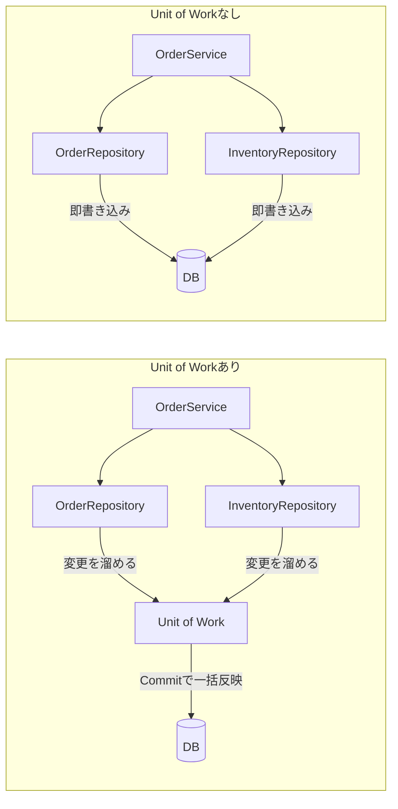

# はじめに
Repositoryパターンを調べているとほぼ確実にセットで出てくる「Unit of Work」

端的にいうと一つの通信で中途半端なcommitはやめようという話なんですが、体系的に勉強してみたので記事にします。

# 対象読者
- Repositoryパターンはなんとなく知ってるけど、Unit of Workが何のためにあるのかピンときていない人
- EF Coreの`SaveChanges()`を「おまじない」として呼んでいる人

# 環境

- Mac M3
- .NET 10

# 題材：ECサイトの注文処理

「注文を受けたら、注文レコードを作って在庫を減らす」というよくある処理を題材にします。

- `Orders`テーブルに注文を追加する
- `Inventories`テーブルの在庫数を減らす

この2つは**必ずセットで成功するか、セットで失敗しなければいけません**。注文だけ入って在庫が減っていなかったら売り越しますし、在庫だけ減って注文が入っていなかったら商品が消えます。

DBを用意するのも大げさなので、今回はDBの代わりになる簡単なクラスを作って挙動を確かめます。

```c#:なんちゃってDB
// 本物のDBの代わり。Dictionaryをテーブルに見立てる
public class Database
{
    public Dictionary<int, string> Orders { get; } = new();
    public Dictionary<string, int> Inventories { get; } = new() { ["りんご"] = 10 };

    public void Dump()
    {
        Console.WriteLine($"注文数: {Orders.Count} / りんご在庫: {Inventories["りんご"]}");
    }
}
```

# Unit of Workなしで書いてみる

まずは素直にRepositoryパターンだけで書きます。Repositoryは「テーブルへのアクセスを1箇所にまとめるクラス」くらいの理解でOKです。

```c#:Repository（即時書き込み版）
public class OrderRepository
{
    private readonly Database _db;
    public OrderRepository(Database db) => _db = db;

    // 呼んだ瞬間にDBへ書き込む
    public void Add(int orderId, string item) => _db.Orders[orderId] = item;
}

public class InventoryRepository
{
    private readonly Database _db;
    public InventoryRepository(Database db) => _db = db;

    // こっちも呼んだ瞬間に書き込む
    public void Decrease(string item, int count)
    {
        var stock = _db.Inventories[item];
        if (stock < count) throw new InvalidOperationException($"{item}の在庫が足りません");
        _db.Inventories[item] = stock - count;
    }
}
```

これを使って注文処理を書きます。

```c#:OrderService
public class OrderService
{
    private readonly OrderRepository _orders;
    private readonly InventoryRepository _inventories;

    public OrderService(OrderRepository orders, InventoryRepository inventories)
    {
        _orders = orders;
        _inventories = inventories;
    }

    public void PlaceOrder(int orderId, string item, int count)
    {
        _orders.Add(orderId, item);            // 1. 注文を保存
        _inventories.Decrease(item, count);    // 2. 在庫を減らす
    }
}
```

一見何の問題もなさそうです。正常系は実際、何の問題もありません。

```c#:Program.cs
var db = new Database();
var service = new OrderService(new OrderRepository(db), new InventoryRepository(db));

service.PlaceOrder(orderId: 1, item: "りんご", count: 3);
db.Dump();
```

```text:実行結果
注文数: 1 / りんご在庫: 7
```

## 在庫より多く注文されると

問題は異常系です。在庫10個のところに15個の注文を入れてみます。

```c#:Program.cs
var db = new Database();
var service = new OrderService(new OrderRepository(db), new InventoryRepository(db));

try
{
    service.PlaceOrder(orderId: 1, item: "りんご", count: 15);
}
catch (InvalidOperationException e)
{
    Console.WriteLine($"注文失敗: {e.Message}");
}
db.Dump();
```

```text:実行結果
注文失敗: りんごの在庫が足りません
注文数: 1 / りんご在庫: 10
```

**注文失敗と言いながら、注文が1件保存されています。**

在庫チェックで例外が飛んだ時点で、注文はもう`Add`で書き込み済みだからですね。呼び出し側で`catch`して「失敗しました」と返しても、DBには失敗したはずの注文が残っている。在庫は10個のまま注文だけが積まれていくので、このりんごは実在庫を無視して売れ続けます。

## 順番を入れ替えればいいのでは？

「先に在庫を減らして、成功したら注文を保存すればいいじゃん」と思いますよね。私も思いました。ですが今度は**注文の保存が失敗したときに在庫だけ減る**という逆パターンの不整合が生まれるだけです。

処理が2つならまだ「失敗したら手で戻す（補償処理を書く）」で凌げるかもしれませんが、「注文を保存して、在庫を減らして、ポイントを付与して、クーポンを消し込む」と増えていくと、どこで失敗したかによって戻す対象が変わるので、補償処理は組み合わせ爆発します。書きたくないですねこれは。

根本的な問題は順番ではなく、**Repositoryを呼ぶたびに即座に書き込んでいること**です。

# Unit of Workで書き直す

そこでUnit of Workです。やることはシンプルで、

1. Repositoryは書き込まず、「やりたい変更」をリストに溜めるだけにする
2. 最後に`Commit`が呼ばれたら、溜めた変更をまとめて反映する
3. `Commit`前に例外が飛んだら、何も反映しない

つまり「**変更の書き込みを遅延させて、反映を1箇所に集める**」パターンです。

図にするとこう



実装します。

```c#:UnitOfWork
public class UnitOfWork
{
    private readonly Database _db;
    private readonly List<Action<Database>> _changes = new();

    public UnitOfWork(Database db) => _db = db;

    // 変更をリストに溜めるだけ。まだDBには触らない
    public void RegisterChange(Action<Database> change) => _changes.Add(change);

    // ここで初めてまとめて書き込む
    public void Commit()
    {
        foreach (var change in _changes)
        {
            change(_db);
        }
        _changes.Clear();
    }
}
```

Repositoryは書き込む代わりに、Unit of Workへ変更を登録するように変えます。

```c#:Repository（遅延書き込み版）
public class OrderRepository
{
    private readonly UnitOfWork _uow;
    public OrderRepository(UnitOfWork uow) => _uow = uow;

    public void Add(int orderId, string item)
        => _uow.RegisterChange(db => db.Orders[orderId] = item);
}

public class InventoryRepository
{
    private readonly Database _db;
    private readonly UnitOfWork _uow;

    public InventoryRepository(Database db, UnitOfWork uow)
    {
        _db = db;
        _uow = uow;
    }

    public void Decrease(string item, int count)
    {
        // チェックはその場で行う（Commit前に弾きたいので）
        var stock = _db.Inventories[item];
        if (stock < count) throw new InvalidOperationException($"{item}の在庫が足りません");

        _uow.RegisterChange(db => db.Inventories[item] = stock - count);
    }
}
```

`OrderService`は最後に`Commit`を呼ぶだけです。

```c#:OrderService
public class OrderService
{
    private readonly OrderRepository _orders;
    private readonly InventoryRepository _inventories;
    private readonly UnitOfWork _uow;

    public OrderService(OrderRepository orders, InventoryRepository inventories, UnitOfWork uow)
    {
        _orders = orders;
        _inventories = inventories;
        _uow = uow;
    }

    public void PlaceOrder(int orderId, string item, int count)
    {
        _orders.Add(orderId, item);            // まだ書き込まれない
        _inventories.Decrease(item, count);    // ここで例外が飛んでも…
        _uow.Commit();                         // ここまで来なければ何も反映されない
    }
}
```

さっきと同じく在庫10個に15個の注文を入れてみます。

```c#:Program.cs
var db = new Database();
var uow = new UnitOfWork(db);
var service = new OrderService(
    new OrderRepository(uow),
    new InventoryRepository(db, uow),
    uow);

try
{
    service.PlaceOrder(orderId: 1, item: "りんご", count: 15);
}
catch (InvalidOperationException e)
{
    Console.WriteLine($"注文失敗: {e.Message}");
}
db.Dump();
```

```text:実行結果
注文失敗: りんごの在庫が足りません
注文数: 0 / りんご在庫: 10
```

今度は**注文も0件のまま**です。`Decrease`で例外が飛んだ時点で`Commit`に到達していないので、溜めていた「注文を追加する」という変更は捨てられ、DBには何も起きていません。

処理が「注文＋在庫＋ポイント＋クーポン」に増えても、途中で例外が飛べば全部なかったことになるので、補償処理を書く必要がありません。**成功したら全部反映、失敗したら全部なし**という境界（トランザクション境界）が`Commit`の1箇所に集まったわけですね。

# 実はEF Coreを使っていれば毎日触っている

ここまで自前で書いてきましたが、実はEF Coreの`DbContext`が**まさにUnit of Work**です。Microsoftのドキュメントにも明記されています。

> DbContextインスタンスはUnit Of WorkパターンとRepositoryパターンの組み合わせを表します

https://learn.microsoft.com/ja-jp/dotnet/api/microsoft.entityframeworkcore.dbcontext

さっきの自前実装とEF Coreを対応させるとこうなります。

| 自前実装 | EF Core |
|---|---|
| `UnitOfWork` | `DbContext` |
| `RegisterChange`（変更を溜める） | 変更追跡（`Add`や`Update`、プロパティ書き換えの検知） |
| `Commit` | `SaveChanges()` |

EF Coreで書くと注文処理はこうです。

```c#:EF Core版
public class OrderService
{
    private readonly AppDbContext _context;
    public OrderService(AppDbContext context) => _context = context;

    public async Task PlaceOrderAsync(string item, int count)
    {
        var inventory = await _context.Inventories.SingleAsync(i => i.Item == item);
        if (inventory.Stock < count) throw new InvalidOperationException($"{item}の在庫が足りません");

        _context.Orders.Add(new Order { Item = item, Count = count }); // まだINSERTされない
        inventory.Stock -= count;                                      // まだUPDATEされない

        await _context.SaveChangesAsync(); // ここで1つのDBトランザクションとしてまとめて反映
    }
}
```

`Orders.Add`もプロパティの書き換えも、その時点ではSQLは1本も飛んでいません。`SaveChanges()`が呼ばれて初めて、溜まった変更がINSERTとUPDATEに変換されて、**デフォルトで1つのDBトランザクションの中で**まとめて実行されます。途中で失敗すれば全部ロールバックです。

つまり`SaveChanges()`は「おまじない」ではなく、**Unit of WorkのCommitそのもの**だったわけですね。「なんで`Add`したのにDBに入ってないの？」という初見殺しも、Unit of Workだと知っていれば「まだCommitしてないから」で説明がつきます。

# 利点の整理

自前実装とEF Coreの両方を見たところで、利点をまとめます。

| 利点 | 内容 |
|---|---|
| 整合性 | 複数テーブルへの変更が全部成功か全部失敗のどちらかになる。中途半端な状態が残らない |
| トランザクション境界が1箇所 | 「どこからどこまでが1つの処理か」が`Commit`の位置で明示される。補償処理が不要になる |
| 書き込みの効率化 | 変更をまとめて送るので、DBとの往復回数を減らせる |
| Repositoryが単純になる | 各Repositoryはトランザクションのことを考えなくてよくなり、変更の登録に専念できる |

個人的に一番大きいのは2つ目かなと思います。Unit of Workがないと「この処理、途中で落ちたらどうなるんだっけ？」を書き込み箇所の数だけ考えることになりますが、あれば`Commit`の前か後かだけ見ればいい。コードレビューで追う場所が1箇所になるのはかなり楽です。

# じゃあEF Coreの上に自前Unit of Workは要るのか

Repositoryパターンの記事でよく見かける、`DbContext`をさらに`IUnitOfWork`インターフェースでラップする実装です。

```c#:よく見るやつ
public interface IUnitOfWork
{
    IOrderRepository Orders { get; }
    IInventoryRepository Inventories { get; }
    Task SaveChangesAsync();
}
```

これについては賛否があって、「`DbContext`が既にUnit of WorkなのにさらにUnit of Workで包むのは屋上屋では？」という指摘はもっともだと思います。

使い分けの目安はこんな感じかなと思います。

| 状況 | ジャッジ |
|---|---|
| EF Coreを普通に使っている | `DbContext`をそのままUnit of Workとして使えば十分 |
| DapperやADO.NETなど、変更追跡がないツールを使っている | 自前Unit of Workを書く価値あり |
| ドメイン層からEF Coreへの依存をどうしても切りたい | インターフェースで包む選択肢はあるが、コスト（コード量・EF Coreの機能が使いにくくなる）と相談 |

# まとめ

- Unit of Workは「変更をその場で書き込まず溜めておいて、Commitで一括反映する」パターン
- これがないと、複数の書き込みの途中で失敗したときに中途半端な状態が残る
- トランザクション境界が`Commit`の1箇所に集まるので、補償処理が不要になり、レビューで追う場所も減る

