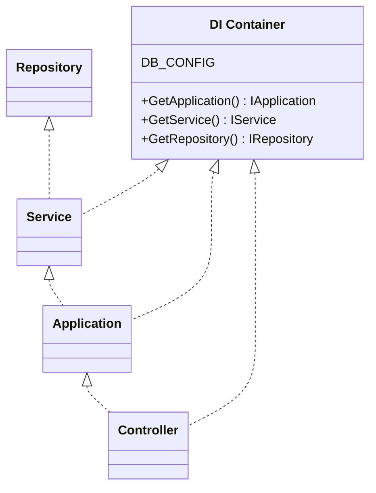

```mermaid
%%{init:{'theme':'default'}}%%
classDiagram
  direction TB
  class `DI Container` {
    DB_CONFIG
    +GetApplication() IApplication
    +GetService() IService
    +GetRepository() IRepository
  }
  class Controller {
  }
  class Application {
  }
  class Service {
  }
  class Repository {
  }
  Application <|.. Controller
  Service <|.. Application
  Repository <|.. Service
  `DI Container` <|.. Application
  `DI Container` <|.. Service
  `DI Container` <|.. Controller
``` 
